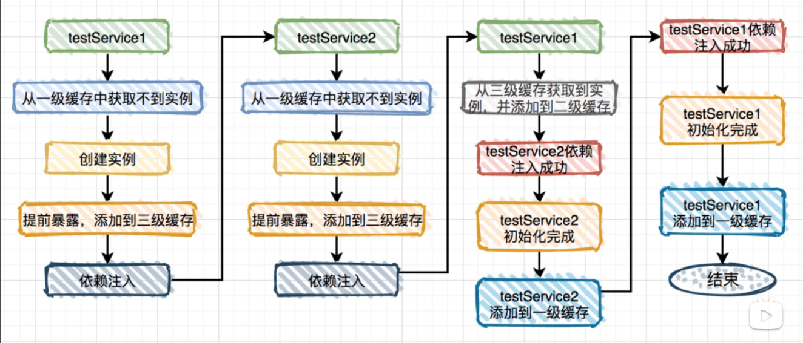

---

title: 面试总结
date: 2024-06-17 16:00:10  
tags:

---

介绍一下你的XX项目？

### 介绍是什么？
+ 青轻论坛是一个实现大学生交流平台，实现**用户发帖交流评论**，实现了**富文本发帖、回帖以及楼中楼回复**、**点赞收藏**、**消息通知**等功能
+ 服务器监控运维系统是一个实时在线监控服务器运行状态以及详细信息的网站，能够做到**服务器状态和信息监控**、**一键SSH远程登录**、**子用户分配具体服务器**等操作
+ 小马链接方便大学生分享网页提供便利简洁性，实现了跳转链接，链接数据记录，分组管理，链接修改灯功能

### 介绍主体功能？
#### 社区
+ 进入系统前的**注册 / 登录**功能（JWT / rabbitmq发验证码 / redis存验证码）
+ 最主要的**帖子相关功能**：富文本发帖 / 评论帖子 / 楼中楼回复 / 收藏点赞帖子 / 隐私展示 / 评论提醒
+ 工具类 接口限流的**基于Redis的固定窗口计数器限流**

#### 小马链接
+ 最主要是链接功能：跳转链接/修改链接/添加链接/链接监控记录
+ 确认消费工具类：**保证消息队列消费确认**

#### 服务器监控运维系统
+ 介绍三个模块：**服务端、客户端、网页端**
+ 服务端：生成token展示在网页端，接收来自客户端的数据并发给网页端展示（并用influxdb存储起来）
+ 客户端：安装在被监控主机上，携带token向服务端注册后定时自动进行数据收集并上报
+ 网页端：展示实时最新数据以及历史一小时的折线图数据等等，并且可以进行SSH连接客户端
+ 另外：管理员可以在网页端进行子用户创建并为其分配可操作的服务器

#### 青轻小镇
+ 优惠券抢购 
+ 点赞关注功能

### 🌟项目有什么难点？
#### 社区内容（点赞和收藏）的数据存储问题
> 由于社区交互数据(如点赞、收藏等) 的更新会非常频繁，更新信息实时到MySQL不太现实，所以需要用Redis做缓冲并在合适的时机一次性入库一段时间内的全部数据
>
> 核心点：**线程池**、**Redis 哈希结构**、**定时任务**、**同步锁**、**数据同步 / 一致性**
>

+ **获取**交互信息：从Redis中获取交互信息，如果Redis中没有则从MySQL中获取
+ **更新**交互信息：**加锁**写入Redis，并且开启定时的入库任务（如果已经开启了，那么仅更新Redis不开启新的）
+ **存储**交互信息：采用Redis的Hash，key为`交互的类型(点赞/收藏)`，hashkey为`用户ID+交互帖子ID`，hashvalue即为`交互的目标状态(false/true)`，并使用线程池往Redis中写入数据
+ **同步**交互信息（**入库**）：设定每3s进行一次Redis中的数据同步到MySQL（同样需要**加锁**写入），**入库后清除**相关交互信息的缓存
+ 🌟🌟🌟为什么**更新Redis**和**入库MySQL**需要**加锁**？

> 这里加锁加的是`synchronized(type.intern())`type是交互类型（点赞/收藏）
>

为了防止发生：入库MySQL的同时来了新的交互数据更新，此时会发生丢失这段新的数据因此需要加锁来让入库的时候，新的交互数据等待入库完毕再写入Redis

+ 🌟如何保障Redis和MySQL的**数据一致性**？
    - 仅从redsi中获取数据，只有不存在的时候才去mysql中取
    - 入库和更新不会同时进行（加锁）、入库后删除所有交互数据

#### 接口限流问题
先介绍主流的几种限流方式：

+ **固定窗口计数器**，优点是实现简单、易于理解和部署，缺点是可能存在时间不对称以及难以应对突发流量
+ **滑动窗口计数器**，优点是能更好应对突发流量，缺点是实现复杂、需要维护窗口的状态
+ **令牌桶算法**，优点是能够很好地平滑流量，允许一定程度的突发流量，缺点是需要更多资源来维护令牌桶状态、不能处理长时间的突发流量
+ **漏桶算法**，优点是可以按照恒定的速率限制请求且算法相对简单，缺点是不够灵活、无法应对突发流量、可能导致请求延迟

再说（我采用的是**固定窗口计数器限流**）

+ 加了一个继承自HttpFilter的限流过滤器在CORS过滤器之后
+ 采用filrer对来自同个IP的请求计数（每次请求前加HTTP过滤器）
+ 限流工具类的Redis的key是ip地址，value是访问次数
+ 编写了多个逻辑的方法以供不同目的的限流，如
    - 针对单次频率限制，请求成功后一段时间不得再发起请求（如点击请求邮件或者手机验证码）
    - 针对一段时间内多次请求的频率限制（如3秒内最多允许20次请求，例如论坛的评论）
    - 针对于需要采取阶段封禁的频率限制（如防止用户频繁申请JWT令牌，如果已经提示无法登录而用户还在请求，那么就封禁更长时间）

#### Feed流推拉结合问题
Feed 指的是根据用户与用户之间的关注关系来召回Feed，然后基于发布时间排序的简单信息流系统。

发表帖子

+ 当用户发表一篇帖子时，将帖子写入到topic表，
+ 然后调用follow表获取粉丝id
+ 异步将内容写入到每个粉丝的inbox列表，并以时间排序
+ 我用inbox表存储uid，fid，tid。uid表示关注的大Vid，fid表示用户id

读取帖子

+ 用户获取feed列表，根据自身id匹配inbox列表中的uid读出所有feed

推拉结合

1. 发布帖子时，如果是大V则仅写入到自身的发件箱中，uid和fid一致
2. 发布帖子时，如果是普通用户，则进行写放大的推模式，uid为自己，fid为粉丝
3. 读取Feed时，读取关注列表，从中识别出哪些是大V用户，并行的读取自身的收件箱，然后读取其他大V的收件箱，拿到topic list后进行合并，返回最新的feed数据。

#### 关注Feed流顺序消息
因为关注需要添加近7天的feed进用户的inbox当中，如果不保证顺序消息很可能导致数据库报错问题，

1. 传统 / 简单 做法：单一消费者，缺点是并发度较高的时候效率很低

> 顺序消费和多线程本身就矛盾，多线程意义就是不在乎顺序、所以才多线程，现在既要顺序又要多线程
>

2. 解决办法：将需要保证顺序的消息放在一块，进行分组然后由单一的消费者消费相当于给单独需要保证顺序的消息加标识，放在单独的queue里由单一消费者消费，其余queue正常多线程消费
3. 我采用的是生产者发送消息，给每个消息指定一个特定路由键，mq会根据路由键将消息发送到不同的Exchange中，消费者通过绑定指定的队列和路由键来接受消息。

- 

# 🌟项目八股
## 🌟社区
### springboot3，相比2有什么不同？
1. **最低Java环境**。SpringBoot3使用Java17作为最低版本，且基于Spring6，而spring boot2最低版本是Java8且基于Spring5
2. **GraalVM支持**。相比 SpringBoot2，SpringBoot3 的 Spring Native 也是升级的一个重大特性，支持使用 GraalVM 将 Spring 的应用程序编译成本地可执行的镜像文件，提升启动速度、峰值性能以及减少内存使用

### Java8-17有什么新特性？
#### Lambda表达式
> 匿名内部类，当且仅当接口内部仅有一个抽象方法（可以有多个，但是其他方法必须有默认实现）
>
> 写成 `() -> {}`
>

#### Optional类
> 更“优雅”地处理**空指针问题**，使用Optional类可以**避免显式的null值判断**
>

```java
String str = null;
if(str != null){   //不使用optional
    list.add(str);
}

//使用Optional
String str = null;
Optional<String> optional = Optional.ofNullable(str);   //转换为Optional
optional.ifPresent(System.out::println);  			   //str非空时再执行方法
```

#### 文本块
```java
String str = """
            你好
            nihao
            hallo
            """
// 可以更好的书写HTML或者SQL语句了，无需写很多转义字符  
```

#### 记录类型record
> 相当于是官方出版的翻版“lombok”
>

```java
public record Account(String username, String password) {	// 字段直接写在括号里
    // 帮我们像lombok一样写好了 全参构造方法 getter hashcode equals toString等方法
}
```

#### 密封类型sealed
> “人如其名”，就是密封了一个类，显式写明只有某些类可以继承这个密封类，其他类都不可以继承
>

```java
public sealed class A permits B{   
    // 在class关键字前添加sealed关键字，表示此类为密封类型
    // permits后面跟上允许继承的类型，多个子类使用逗号隔开
    // 表明只有类B可以继承类A，并且必须有类继承A
    // 继承的子类必须显式标记为final、sealed或是non-sealed类型(非密封类，代表可以继承了)
}
```

### 🌟介绍一下 JWT？和session比起来有什么优劣？
jwt（json web token）由三部分**组成**：

+ 标头(header)：包含一些元数据  例如JWT使用的加密算法 / 类型
+ 有效载荷(payload)：包括用户名称、令牌发布时间 / 过期时间、JWT ID等，自定义的字段也存在这里
+ 签名(signature)：根据服务端的密钥，再按照标头中指定的算法对标头和载荷加密后再进行base64编码得到（用于验证此token是否被篡改过）

jwt的**优点**：

+ **可扩展性好**，分布式部署的情况下，session需要做多机数据共享，通常存在数据库或者redis，而jwt不需要
+ **无状态**，jwt不在服务端存储任何状态，且jwt的载荷中可以存储一些常用的用户信息用于交换，有效使用jwt还可以降低服务器查询数据库的次数
+ 安全性: JWT使用数字签名或加密算法保证token的完整性和安全性。每次请求都会验证token的合法性，防止伪造或篡改。

jwt的**缺点**：

+ **性能问题**：由于是无状态使用jwt，所有的数据都放在jwt中，如果还有自定义字段，载荷会更大，cookie很可能放不下，所以一般都放在local storage里面，并且用户每一次http请求都需要在header里携带jwt，因此使用jwt请求比使用session的开销大
+ **无法即时失效**：一旦签发一个jwt，到期之前始终有效，无法中途废弃。用户注销时或者jwt载荷里的用户信息需要更新时，签发了新的jwt，但旧的jwt还没过期，依然可以登录或者服务端拿到的载荷信息是过时的（为了解决这个问题，我的项目在后端编写了额外的逻辑，**黑名单机制**：一旦签发了新的jwt，就把旧的加入黑名单(比如存到redis里面)，避免被非法再次使用）
+ **续签麻烦**：传统的cookie续签方案一般是框架自带，但jwt到期就需要签发新的jwt，因此需要前端需要配置JWT自动续签，在发起请求时如果令牌即将到期，那么就向后端发起续签请求得到一个新的JWT令牌

### 如果要统计一天之内论坛登录过的人数怎么做？
答：基于**Redis**或者**数据库** 存储登录过的用户ID

+ 基于Redis
    - **BitSet**（位集合，精准 但是占用空间更大） `setbit` 添加用户  `bitcount`统计用户
    - **HyperLogLog**（更适合，但是有一些误差）`pfadd`添加  `pfcount`统计
+ 数据库简单存储一张表 每天定时清空再存新的即可

### “楼中楼”评论是如何做的？
答：**数据库中额外的引用字段**

+ 数据库comment表中有一个quote字段和root字段，如果是一级评论（也就是直接评论帖子）则quote，root字段值均为-1（无效值）
+ 如果是评论的评论，那么子评论的quote字段的值为父评论的ID，root字段值为根评论的ID

### delta是什么存储格式 ？为什么用它？
+ delta是quill（强大的开源富文本编辑器）存储文本内容及其样式的一种数据格式，本质上是一种JSON
+ delta相比html没有歧义和复杂（没有html的各种标签），缺点是前端从数据库中拿到帖子内容后需要解析
+ XSS，跨站脚本攻击（Cross-Site Scripting）（简称与css重合 因此叫xss）简单来说就是：想办法“教唆”用户的浏览器去执行一些这个网站中不存在的JS代码
+ delta可以降低xss攻击的风险，就是因为无法直接在前端页面中展示，需要经过额外处理，处理时可以筛掉非法的标签例如`<srcipt>`等

### 🌟为什么要用RabbitMQ？
+ 🌟🌟🌟任何相关MQ的问题，优先答**MQ的三大作用：异步、解耦、削峰**
    - **异步**，将消息写入消息队列，非必要的业务逻辑以异步的方式运行，不影响主流程业务。
    - **削峰填谷**，当系统压力较大时，消息可以缓存起来逐渐处理，从而避免系统崩溃或过载
    - **解耦**，当一个系统较为复杂，可以降低它的耦合度，提高他的扩展性。
+ **相比多线程**
    - **消息持久化**，提高了系统的稳定性，系统down了，但消息存储在外部，不会丢失
    - **削峰填谷**，当系统压力较大时，消息可以缓存起来逐渐处理，从而避免系统崩溃或过载
    - **解耦**，当一个系统较为复杂，可以降低它的耦合度，提高他的扩展性。
+ **对比其他主流消息队列**
    - **简单易用**：RabbitMQ 提供了简单易用的API，易于上手和部署
    - **灵活的路由和交换机机制**：可以根据消息的特性和路由规则进行高效的消息分发
    - **自带的管理界面简单方便，社区活跃度高（文档齐全丰富）**
    - **缺点**：用erlang开发，难以进行二次开发和维护，吞吐量相比rocketmq/kafka低

### 延时任务怎么实现的
+ 我利用一个普通队列和一个死信队列，普通队列绑定死信交换机和死信路由key，设置ttl过期时间，在到达时间后，消息会根据死信交换机传送到相应绑定的队列进行消费。但是这个有所限制，这个ttl过期时间是固定的，无法修改，但可以用作订单超时自动取消。
+ 优惠券则是通过coverAndSend的时候通过messageProperties的setExpiration过期时间来实现的

### 为什么选用MinIO存储图片？
+ MinIO是一个开源免费的**对象存储**服务器，核心功能是对象存储，并提供了多种API和SDK访问这些对象
+ 参考官方文档就可以使用Minio官方提供的Java SDK进行操作，进行文件的存储
+ 如何对接MySQL？
    - MySQL中有一张表，表中存储上传图片的用户ID，和图片的存储路径、存储时间等
    - 往MinIO里存储图片的同时，往表中插入数据，以便管理员端可以按需依靠索引快速访问图片数据
+ 🌟🌟🌟为什么不用MySQL直接存储图片？而非要用Minio？
    - 存储图片（或者任何大型二进制数据）时，使用MySQL直接存储会遇到以下挑战和限制：
        * **性能不佳**：由于图片等二进制数据体积较大，MySQL对于大型二进制数据的存储和检索性能不佳
        * **难以水平扩展**：随着数据量增加，难以水平扩展
        * **难以备份和恢复**：备份和恢复非常耗时，且需要大量存储空间
    - 相比来说，使用对象存储服务（如MinIO）存储图片等大型二进制数据，有以下优势：
        * 上面三条相反，性能好，可扩展，备份和恢复
        * **数据管理**：对象存储服务通常提供了丰富的管理功能，如数据版本控制、访问控制、生命周期管理等，可以帮助用户更好地管理和保护数据

### 日志 雪花算法
+ 雪花算法是一种分布式 ID 生成方案，它可以生成一个长度为 **64 位的唯一ID**，其中包含了**时间戳**、**数据中心 ID** 和**机器 ID** 等信息
+ 编写请求日志过滤器，在每个HTTP请求之前，获取请求的接口URL、参数、远程IP地址、用户角色、ID等

### 过滤器和拦截器的区别
1. 出身不同：过滤器来自于 Servlet，而拦截器来自于 Spring 框架
2. 触发时机不同：**请求进入容器 > 进入过滤器 > 进入 Servlet > 进入拦截器 > 执行控制器（Controller）**
3. 实现不同：**过滤器是基于方法回调实现的**，**拦截器是基于动态代理（底层是反射）实现的**。
4. 支持的项目类型不同：过滤器是 Servlet 规范中定义的，所以**过滤器要依赖 Servlet 容器，它只能用在 Web 项目中**；而**拦截器是 Spring 中的一个组件，因此拦截器既可以用在 Web 项目中，同时还可以用在 Application 或 Swing 程序中**。
5. 使用的场景不同：因为拦截器更接近业务系统，所以**拦截器主要用来实现项目中的业务判断的**，比如：登录判断、权限判断、日志记录等业务。 而**过滤器通常是用来实现通用功能过滤的**，比如：敏感词过滤、字符集编码设置、响应数据压缩等功能。

## 小马链接
### 双重判定锁怎么实现的？
这是跳转短连接的功能，首先使用布隆过滤器对当前短链接进行判断是否存储，如果没有则直接跳转空页面，有的话再进行一次判断，从redis获取该短链接是否为空，如果是的话也跳转空页面，不是的话对短链接进行上锁，在进行redis判断，如果还是没有则进行跳转短连接操作，通过这个锁可以优化更新后或者失效场景查询数据库问题。因为短链接失效后布隆过滤器仍然存储该短链接需要利用redis进行判空处理，而如果布隆过滤器都没有的话则说明当前短链接肯定不存在直接跳转即可

### 介绍一下布隆过滤器，怎么使用的？
布隆过滤器是一种数据结构，用于快速判断一个元素是否存在一个集合中，它牺牲一定的准确性为代价，换取了存储空间的极大节省和查询速度的显著提升。在当前项目中我初始化了一个可以存储1百万个元素的布隆过滤器，误码率在0.001，太高的误码率肯呢个会导致性能的缺失，因此我选择了这个，  
在创建链接的同时判断布隆过滤器是否存在这个短连接，存在则抛出异常，否则的话，布隆过滤器添加该短连接。

### 先更新数据库后删除缓存，怎么保证缓存与数据库的一致性呢？
在更新短连接的时候，我通过上锁和Transactional注解保证只有一个线程访问，我需要修改分组中的短链接数据，并且把goto表中原数据进行删除，添加新数据进去，否则可能导致访问错误短连接，然后按照时间判断，删除原来的短连接缓存，那下次访问的时候则会生成一个新的缓存跳转短连接，而不是读取旧的缓存。从而保证数据库与缓存的一致性

### RabbitMq怎么进行削峰？
因为每次点击短链接跳转的时候会记录很多数据，例如手机型号，ip地址，访问次数，浏览器类型等等数据，这样的话需要添加数据进多个表里面，在高访问场景下对数据库的压力比较大，因此将数据添加操作转移到消息队列中，进行实现削峰

### Redis怎么实现消息队列幂特性
我实现了一个工具类，生产者发送数据时设置一个uuid，消费的时候首先从当前数据获取uuid，利用双重判断，先判断redis中是否存在该uuid，没有则设置该uuid为0，继续进行，如果存在，则继续判断该uuid是否被消费，消费了直接返回，如果消费过程中出现错误则抛出异常删除key，最后处理结束设置key为1并且带有过期时间，保证消息不被重复消费

### 跳转短链接功能怎么实现的
前端传来的参数是shortUri就是一个随机数，通过封装获取得到完整短链接，通过redis获取该短链接是否近期访问，然后统计数据跳转页面，利用双重判定锁保证数据可靠，如果gotolink不存在则进行上锁，再次进行redis判断，然后获取数据库goto表，就是完整短链接，如果没有则判空，存redis空，再查询link表，获取短链接实体类，根据日期判断，是否访问，监控短链接访问数据，跳转，设置redis

## 服务器监控运维系统
### 客户端用于定时任务调度的SpringQuartz是什么？怎么用的？
+ 是基于Spring的一个功能强大、开源的**任务调度框架**，核心要素主要为：
    - Job：定时任务的主体，也是写业务逻辑的地方，如，我们在这里写收集客户端的运行信息
    - JobDetail：任务的详细信息，包含了任务的标识ID、任务描述、任务存储方式等等
    - Trigger：触发器，用来定义任务的执行规则，如几点执行，几点结束，多长时间执行一次等等
    - Scheduler：用来调度任务的，一个Scheduler就是一个调度容器，可以调度多个JobDetail和Trigger
+ 在项目中，我主要使用SpringQuartz实现客户端每十秒钟向服务端报告自身信息

### 客户端的oshi框架是什么？都采集了什么信息？
+ Oshi 框架是一个用于**获取系统信息**的 Java 库
+ 它允许开发人员查询和获取有关计算机硬件和操作系统的各种信息，它**和Java自带的包**相比起来，可以获取**更丰富的信息**，且具有**跨平台性**，并且使用**简单**
+ 我利用Oshi框架获取了客户端的**操作系统名称和架构以及版本**、**CPU名称和核心数**（以及**CPU使用率**）、**内存大小**（包括已用）、**硬盘大小**（包括已用）、**IP地址**，以及**网络的上传 / 下载速度**，**磁盘读写速度**等

### 怎么实现的前端shell操作？简要介绍一下websocket？
+ 采用**Xterm.js**作为前端伪终端实现，然后基于websocket连接实现前端shell操作
+ 🌟**WebSocket** 是一种在单个 TCP 连接上进行全双工通信的协议，它是**应用层**协议
    - **全双工通信**：客户端和服务器之间可以同时发送和接收数据，实现真正的双向通信
    - **低延迟**： 使用单个 TCP 连接，减少了建立连接和发送数据的延迟，实现更快的数据传输速度
    - **持久连接**：WebSocket 连接是持久性的，与 HTTP 连接不同，它不需要在每次通信时重新建立连接，可以在连接保持的情况下连续发送数据
    - **与HTTP兼容**：WebSocket 握手过程与 HTTP 兼容，可以通过标准的 HTTP 端口（通常是 80 和 443）进行通信，并且可以在现有的基础设施上轻松部署
+ 与WebSocket不同，**Socket套接字**，是位于**应用层和传输层**之间的一组**接口**，它是为了方便使用TCP/UDP而抽象出来的，相当于使用了设计模式中的**外观模式**把复杂的TCP/IP协议族隐藏，用它即可
+ 总的来说，**WebSocket 是一种高层次的协议，专门用于实时通信的 Web 应用程序**，而 **Socket 则是一种通用的底层网络通信接口，可以用于各种网络通信场景**。WebSocket 可以看作是在 Socket 的基础上实现的一种高层次的应用层协议

### 为什么有mysql还要用influxdb存储信息？
+ **场景适合**：InfluxDB 是一种专门用于存储和处理时序数据的数据库，非常适合这种物联网存储历史信息场景
+ **特殊优化**：它针对时间序列数据进行了优化，提供了高效的存储和查询方式，对于需要处理大量时间序列数据的场景比MySQL更合适
+ **按ID以及字段存取方便**：相比MySQL关系型数据库采取表格存储，它使用标签(tag)和字段(field)来存储数据，这种存储方式适合存储大量根据时间且需要根据不同主键的数据，在我的项目中，标签即可代表服务器ID、字段代表每台服务器不同类型的信息

### 你的管理员用户 子用户 权限校验是怎么做的？
+ 在SecurityConfig中配置，任何操作子用户的接口都需要admin角色
+ 并且，在数据库的用户表中加入角色和可操作的服务器列表
+ 当用户对服务器进行增删改查的时候，对用户进行鉴权，查看其是否拥有此服务器的操作权限

# JavaSE
## 基础
### JDK、JRE、JVM有什么区别？
+ JVM（Java虚拟机）是Java程序的运行环境，它负责将Java源代码编译成的字节码在各种操作系统上执行，并且不同平台都有对应的JVM实现，从而实现跨平台。

> JVM是用于执行Java程序的核心模块，但是它并不能单独安装到我们的电脑上，我们一般都是下载安装JDK或JRE，它们包含了JVM和一些其他的东西
>

+ JRE（Java运行环境）包含了JVM和Java类库，面向客户和使用者，可以用来运行已经编译完成的Java程序。在不需要进行Java开发的情况下，仅需要安装JRE即可运行Java程序即可。
+ JDK（Java开发工具包）是Java开发的核心工具包，面向开发者，它不仅包含了JRE的全部内容，还额外包含了编译器（javac）、调试器（jdb）、Java库（Java API）等适用于我们开发人员使用的相关工具。


### 🌟字节码
#### 什么是字节码？
Java字节码就是程序编译之后的一种中间代码，它由Java编译器生成，可以在Java虚拟机（JVM）上运行。Java源代码在经过编译后会被转换为字节码文件（以.class为文件扩展名），而不是直接编译成平台相关的机器代码。


#### 使用字节码好处是什么？
便于实现**跨平台**，因为JVM上可以读取并执行字节码，而不同平台都有对应的JVM，这样就可以实现跨平台通用了

#### Java是如何实现跨平台的？
由于Java程序编译后会变成字节码文件，它有着统一的标准，无论在哪里编译出来都是一样的。同时，不同系统都有对应的JVM实现，无论放在哪个平台上的JVM执行，都是一样的，这样就可以做到一次编译到处运行了

### Java是编译型还是解释型语言？
先看什么是编译型什么是解释型：

> 简单来说：编译型语言在运行前需要整体编译成机器语言或者中间代码，而解释型语言则是在运行时逐行解释并执行源代码
>

+ **编译型语言：**优点是计算机直接运行，性能高；缺点是与平台密切相关，在一种操作系统上编译的程序，无法在其他非同类操作系统上运行，比如Windows下的exe程序在Mac上就无法运行。
+ **解释型语言：** 只需要通过解释器代为执行即可，不需要进行编译。优点是可以跨平台，缺点是需要依靠解释器解释执行，效率肯定没直接编译成机器指令运行的快，并且会产生额外的资源占用。

Java需要先编译为字节码再由JVM解释为机器指令执行，可见，它同时具备两种类型的特性，因此**Java既是编译型也是解释型语言**

#### JIT即时编译是什么？
> JIT编译器（是JVM的一部分）负责**将频繁执行的字节码转换为本地机器代码**，从而提高程序的执行速度
>
> 简单来说就是，没有JIT，JVM就一句一句翻译字节码并执行，有了JIT就可以直接大段的直接进行“预翻译”并直接执行，让程序执行的更快。（**编译和解释并存**）
>

## 🌟面向对象
### 面向对象三大特性都是什么？
封装 继承 多态

### 什么是重载什么是重写？
> 重载是多个同名方法，重写是子类Override重写父类方法
>

+ **重载（Overload）** 是指在同一个类中可以存在多个**同名方法**，但参数列表不同，返回类型可以相同也可以不同的情况（注意，不能是参数相同仅返回值不同）在调用重载方法时，根据传入的参数类型和个数来确定调用哪个重载方法（提高代码复用性和灵活性
+ **重写（Override）****是指****子类重新定义父类中已经有的同名、同参数列表和返回类型的方法**。在使用多态时，调用子类对象的该方法时会执行子类中的方法而不是父类中的方法。重写可以实现子类对父类方法的个性化定制

### 🌟final字段有什么作用？
+ 修饰变量：修饰的变量不可变，且必须被显式指定初始值

>  此处不可变指的是**引用不可变** 如果是对象则不可以更改引用 但其中的值还可以修改
>

+ 修饰方法：不可以被重写
+ 修饰类：不可以被继承

### 访问修饰符？
| 修饰符 | 当前类 | 同一包内 | 子孙类(同一包) | 子孙类(不同包) | 其他包 |
| :--- | :--- | :--- | :--- | :--- | :--- |
| `public` | Y | Y | Y | Y | Y |
| `protected` | Y | Y | Y | Y/N（[说明](https://www.runoob.com/java/java-modifier-types.html#protected-desc)） | N |
| `default` | Y | Y | Y | N | N |
| `private` | Y | N | N | N | N |


#### 子类会不会继承父类的private属性？
父类的private属性子类无法直接访问，但是依然可以通过间接的形式去访问父类定义的属性，如果这个属性没有被继承，那么子类肯定是访问不到这个属性的，所以private是会被继承的

### 抽象类和接口？
> 接口只是具有哪些能力的一个代表而已。而抽象类不同，抽象类再怎么抽象，它本质上也依然是一个类，类是可以具有属性的（但是二者都不可以被new实例化）
>

1. 接口
    - 只能包含抽象方法
    - 接口可以定义属性 但是默认为public static final的（后面的jdk版本）
    - 实现接口必须实现所有方法
    - 接口支持多继承（implements）
2. 抽象类
    - 可以同时包含抽象方法和普通方法
    - 可以有构造方法 但是不能new实例化抽象类的对象
    - 不支持多继承（extends）

区别：

+ 一个类只能继承一个父类，但是可以实现多个接口。
+ 接口是对类的行为约束，抽象类主要是代码复用，可以继承属性，行为，方法。
+ 接口中的成员变量只能是 public static final 类型的，不能被修改且必须有初始值，而抽象类的成员变量默认 default，可在子类中被重新定义，也可被重新赋值

### 🌟🌟🌟== 和 equals方法 的区别？
在Java中，`==`操作符和`equals()`方法都是用于比较两个对象，但它们在使用上有着本质区别：

1. 使用`==`运算符
    - **基本类型**：当用于基本数据类型比较时（如`int`，`char`等），`==`比较的是两个值是否相同
    - **对象类型**：当用于对象比较时，`==`比较的是两个对象引用是否指向堆内存中的同一个位置。即它比较的是对象的内存地址，而非内容
2. 使用`equals()`方法
    - `equals()`方法用于比较两个对象的内容是否相等，默认情况下（例如在`Object`类中定义），`equals()`方法和`==`操作符的行为相同，都是比较对象的内存地址
    - 但是，很多内置类（如`String`、`Integer`等包装类）中预先为我们重写了`equals()`方法，使其比较的是对象的内容而不是它们的引用。因此，即使是两个不同的对象，只要它们的内容相同，使用`equals()`方法比较时就会返回`true`

### 🌟🌟🌟equals 和 hashCode？
#### 什么是hashCode？
在Java中，`hashCode()` 方法是用来返回对象的哈希码的。哈希码是一个整数，用来表示对象的唯一标识。Java中默认的 `hashCode()` 方法是从对象的内存地址计算出来的

#### 为什么要有hashCode？
哈希码主要用于优化具有哈希结构的集合（如`HashMap`、`HashSet`等）的性能。当向这些集合中添加或检索元素时，Java会使用对象的哈希码来快速定位该对象可能存储的桶位置，**提高对象比较的效率**

#### 为什么重写 equals 时必须重写 hashCode ⽅法？
> 为了保证`equals()`方法和`hashCode()`方法之间的一致性，尤其是在使用`HashMap`、`HashSet`等集合的时候
>

1. **维护相等对象的一致性**：如果两个对象的`equals()`方法判定相等，那么它们必须具有相同的哈希码，`hashCode()`方法默认根据对象自身的内存计算独特值，如果没有重写，那么相同类的两个对象的哈希值无论如何也不可能相等（即便两个对象数据一样）
2. **具有哈希结构的集合的实现依赖于hashCode()方法**：如果两个相等的对象却具有不同的哈希码，那么哈希表将无法正确处理它们，可能会导致元素无法被正确存储或检索

### Java是 值传递 还是 引用传递？
Java语言是**值传递**，基本数据类型，还是引用数据类型，都是按照值传递的方式进行传递

+ **基本类型:** 当你传递一个基本类型给一个方法时，你实际上传递的是该变量值的拷贝，在方法内部对这个值的任何改变都不会影响原始值
+ **引用类型:** 当传递一个引用类型（例如对象）时，传递的是对象引用（或者说指针）而不是对象本身，不过，如果在方法内部改变了引用所指向对象的状态（例如，改变了一个对象的属性）那么肯定原始对象也会被改变

### 什么是深拷贝 浅拷贝？
+ **浅拷贝(Shallow Copy)** 浅拷贝是指创建一个新对象，但只复制原始对象的基本数据类型的数据值，而引用类型数据仍然指向原始对象的内存地址。（根据B复制了A但是B指向A，B修改会影响A）
+ **深拷贝(Deep Copy)** 深拷贝同样是指创建一个新对象，但是此时复制的不仅仅是基本数据类型数据，同时引用类型所指向的对象也会被复制，得到一个新的对象并引用（根据B完全创造了A，AB之间互不关联了）

## 常用类
### String类可以被继承吗？
不可以

1. 保存字符串的数组是被 final 修饰且私有的，且 String没有提供相关修改这个数组的方法。
2. String类 被 final 修饰导致不能被继承，进而达成 String 不可变。

### String   StringBuilder   StringBuffer？
> 都是用于处理字符串的类，都实现了CharSequence接口
>


+ String：不可变，故而线程安全，但频繁的字符串拼接操作会产生大量临时对象，影响性能
+ StringBuffer：方法都使用`synchronized`关键字进行同步保证线程安全，但性能相对较低
+ StringBuilder：没有进行同步，不具备线程安全，性能更好，但需要自行保证线程安全

### String str1 = new String("abc")和String str2 = "abc" 和 区别？
> 运行时常量池位于**方法区**，字符串常量池位于**堆**，对象也位于**堆**
>

+ 两个语句都会去**字符串常量池**中检查是否已经存在 “abc”，如果有则直接使用，如果没有则会在常量池中创建 “abc” 对象
+ 对于 `String str1 = new String("abc")`，无论字符串常量池中是否已经存在 `"abc"` 字符串，都会在堆内存中创建一个新的对象。因此，`str1` 和任何其他 `"abc"` 字符串对象都不会相等（除非是同一个对象的引用）

### String的intern方法有什么作用？
>  它返回的是**字符串常量池中的引用**
>

+ 如果常量池中已经存在等于此字符串对象的字符串，则返回常量池中的引用
+ 否则，将此字符串对象添加到常量池中，并返回该对象的引用

```java
String s1 = new String("hello");
String s2 = "hello";

String s3 = s1.intern(); // 返回常量池中的引用
System.out.println(s1 == s2); // 输出 false，因为s1和s2是两个不同的对象
System.out.println(s2 == s3); // 输出 true，因为s3是从常量池中返回的引用，与s2相同
```

### Object类的常见方法？


## 异常
> 值得注意的是：即便 try/catch 里面 return 了 还是会执行 finally
>


### 序列化
#### 什么是序列化？反序列化？
序列化就是把Java对象转为二进制流，方便存储和传输

所以反序列化就是把二进制流恢复成对象

#### Serializable接口有什么用？
Serializable接口是Java提供的一个标记接口，用于标识类可以被序列化。实现 Serializable接口的类可以将对象转换为字节流进行传输和存储，实现数据的持久化和 跨平台的数据交换

#### serialVersionUID 有什么用？
serialVersionUID是Java中用于序列化和反序列化的一个特殊字段。它是一个静态常量，用于标识序列化类的版本号，它是一个64位的long类型数字，具有以下作用：

+ 版本控制
+ 兼容性

#### Java 序列化不包含静态变量？
Java序列化只会保存对象的非静态成员变量，不包含静态变量

#### 如果有些变量不想序列化，怎么办？
使用` transient `关键字修饰。

## 反射
### 什么是反射？
> **动态地**获取类信息、创建类实例、调用类方法这时候就要用到反射
>


### 反射的应用场景
像 Spring / Spring Boot、MyBatis 等等框架中都大量使用了反射机制

Spring里的很多注解 ，它真正的功能实现就是利用反射

### 反射的实现原理？
> 基于JVM的**类加载机制和类对象模型**
>

在Java 中，每个类都有一个对应的Class对象，该对象包含了类的名称、字段、方法等信息。通过反射，我们可以获取到这些信息，并在运行时动态地操作类和对象

# Java集合
### 🌟ArrayList和LinkedList的区别？
+ 数据结构不同（前者**动态数组**，后者**双向链表**）
+ 前者利于查找、后者利于增删
+ 是否支持随机访问
+ 内存占用（是否连续）

#### ArrayList扩容机制
+ ArrayList 默认大小是 10
+ ArrayList 默认是以空数组进行创建的，当真正对数组添加元素的时候，才真正分配容量。
+ 当加入 n + 1 个元素时，进行扩容，定义一个newCapacity，这个新的容量是**旧容量的 1.5 倍**。进而调用 Array.copyOf()

### 线程安全的 List是如何实现线程安全的
CopyOnWriteArrayList底层通过数组保存数据，使用volatile关键字修饰数组，保证当前线程对数组对象重新赋值后，其他线程可见。  
并且写入操作时，添加ReentrantLock保证线程安全。

### HashSet，LinkedHashSet，TreeSet的区别
+ 都能保证元素唯一，并且都不是线程安全的。
+ HashSet 的底层数据结构是哈希表（基于 HashMap 实现）。
+ LinkedHashSet 的底层数据结构是链表和哈希表，元素的插入和取出顺序满足 FIFO。
+ TreeSet 底层数据结构是红黑树，元素是有序的，排序的方式有自然排序和定制排序。
+ HashSet 用于不需要保证元素插入和取出顺序的场景，LinkedHashSet 用于保证元素的插入和取出顺序满足 FIFO 的场景，TreeSet 用于支持对元素自定义排序规则的场景。

### 🌟快速失败 和 安全失败？
> 两种“失败”源于**在遍历集合的同时有对集合做修改**，尤其是在面对**多线程环境下**的**并发修改**时所采取的不同策略
>

#### 快速失败
> 位于`java.util`包下的`ArratList / LinkedList / HashMap`等都采用快速失败
>

+ **现象**：如果在迭代过程中有线程（包括本身）对集合进行了修改（添加/删除/更新），那么会立刻检测到这个修改并**迅速抛出异常**
+ **原理**：通过**维护一个内部计数器**（如`modCount`）来跟踪集合结构的变化。每次对集合进行结构修改时，这个计数器会递增，迭代器在每次调用`next()`或`remove()`方法前检查当前计数器值与遍历开始时记录的预期值是否一致。如果不一致，说明集合已被并发修改，于是立即抛出异常
+ **如何解决**？
    - **删除元素**：使用迭代器的`remove()`方法 / 使用集合自带的`removeIf()`方法
    - **多线程**：加锁修改，**使用并发集合**（如`CopyOnWriteArrayList / ConcurrentHashMap`等）

#### 安全失败
> 位于`java.util.concurrent`包下的`CopyOnWriteArrayList / ConcurrentHashMap`等都采用安全失败
>

+ **现象**：在遍历时不是直接在集合内容上访问的，而是先复制原有集合内容，在拷贝的集合上进行遍历
+ **原理**：由于迭代时是对原集合的拷贝进行遍历，所以在遍历过程中所作的修改并不能被迭代器检测到，所以不会触发**快速失败**而抛出异常
+ **缺点**：迭代器并不能访问到修改后的内容（开始遍历的那一刻就一直拿的是原始集合）

### 讲讲HashMap？
#### 数据结构
数组+链表+红黑树

在jdk1.8 之后在解决 Hash 冲突的时候有了优化，当**链表长度大于 8** 且**数组长度大于 64** 时，将链表转换成红黑树。

#### 红黑树特点
+ **节点颜色**：每个节点或者是黑色，或者是红色
+ **根节点和叶子节点**：根节点和叶子节点（`NIL`）是黑色的
+ **颜色规则**：如果一个节点是红色的，则它的父节点/子节点必须是黑色的
+ **路径规则**：从任意节点到其每个叶子节点的路径都包含相同数量的黑色节点

#### HashMap哈希函数怎么设计的？
> 这样设计达到高位低位混合的效果，增加哈希值随机性，降低哈希冲突概率
>

+ 先通过hashCode获得key的哈希值（32位）
+ 再将哈希值右移16位，与哈希值本身**异或**

#### HashMap和Hashtable的区别？
都实现了Map接口，但是有以下不同：

+ HashMap可以接受`null`的key和value，Hashtable不行
+ HashMap是非线程安全的，HashTable是线程安全的
+ Hashtable很多方法是同步方法，在单线程环境下它比HashMap要慢
+ 哈希值的使用不同，HashTable直接使用对象的hashCode，而HashMap重新计算hash值

#### LinkedHashMap和TreeMap是如何保证有序的？
前者双向链表，后者红黑树

#### HashMap 多线程死循环了解吗
在 JDK1.8 之前，多线程的情况下，当一个桶位中有多个元素需要进行扩容，执行的**头插法**会导致链表中的节点指向错误，从而形成一个环形链表，死循环。

在 JDK1.8 之后，使用的是**尾插法，**新的元素永远在尾部，能避免死循环，但是多线程情况下还是使用 ConcurrentHashMap 合适。

#### HashMap 为什么线程不安全
+ 多线程情况下，会导致**数据丢失。**
+ JDK1.8 中，多个 KV 对有可能被分配到同一个桶中，多线程 put 的话会有数据被覆盖的风险。

### ConcurrentHashMap了解多少？
> + 相对于普通的HashMap，它提供了一种线程安全的HashMap实现。 底层数据结构是Node数据 + 链表/红黑树，通过 synchronized + CAS 来实现线程安全
>

#### JDK1.7
> 采用分段锁机制，一个Segment数组，相当于每个Segment都是一个HashMap（但是**没有红黑树** 只有链表），Segment之间相互不会受到影响
>

+ put 流程
    1. 计算hash 定位到segment 为空就初始化
    2. 使用**ReentrantLock**加锁，获取锁失败旧尝试自旋，自旋超过次数旧阻塞获取保证一定成功
    3. 遍历HashEntry，和HashMap一样，尝试插入进node
+ get 流程	get很简单，key通过hash定位到segment，再遍历链表定位到具体元素（注意：value是volatile的 所以get无需加锁）

#### JDK1.8
> 数据结构和HashMap是一样的，**数组+链表+红黑树**。通过 synchronized + CAS 来控制。它实现线程安全的关键点在于put流程
>

+ put 流程
    1. 首先计算hash，遍历node数组，如果node是空的话，就通过 CAS+自旋 的方式初始化
    2. 如果当前数组位置是空则直接通过 CAS自旋 写入数据
    3. 如果hash==MOVED，说明需要扩容，执行扩容
    4. 如果都不满足，就使用synchronized写入数据，写入数据同样判断链表、红黑树，链表写入和HashMap的方式一样，hash一样就覆盖，反之就尾插法，链表长度超过8就转换成红黑树
+ get 流程get很简单，无锁化读取，和HashMap的get流程基本相同
+ JDK1.8 之后锁的颗粒度更细，只会锁当前链表或者红黑树的首节点，只要 Hash 不冲突，并不会产生并发也不影响其他 Node 的读写。

# Spring
> Spring 是一款开源的轻量级 Java 开发框架，旨在提高开发人员的开发效率以及系统的可维护性。
>

### IOC
> 使用IOC最主要的作用就是**解耦**，不再关心对象之间的依赖
>

+ IOC(Inversion of Control)：**控制反转**，控制对象生命周期的不再是引用它的对象，而是容器，由容器来负责控制对象的生命周期和对象间的关系（将对象管理的权力交给Spring）
+ 比如当我们需要一个接口的实现时，由它根据配置文件来决定到底给我们哪一个实现类，这样，我们就可以不用再关心我们要去使用哪一个实现类了

### DI
> **依赖注入**，指的是容器在实例化对象的时候把它依赖的类注入给它
>

#### 有哪些方法可以依赖注入？
+ 构造方法注入
+ 属性注入
+ 工厂方法注入
    - 非静态工厂
    - 静态工厂

#### @Component和 @Bean
+ @Component 作用于类上，@Bean 作用在方法。
+ @Component 通常通过启动配置@ComponentScan扫描到的类，自动装配到了 Bean 容器中。而@Bean 是当需要的用到的时候，Spring 才给调用方。

#### @Autowired和@Resourse有什么区别？
+ @Autowird 是Spring提供的，默认是 byType 的，优先匹配类型注入 Bean。
+ @Resource 是JDK提供的，默认是 ByName 的，如果找不到相对应的 Name 时，才会转成 byType。

#### Bean是线程安全的吗？
+ 按原理来说是线程不安全的，通常 bean 的作用域是 Singleton 单例的，会存在资源的竞争。
+ 大部分的 Bean 都是无状态的(都是不可变的成员变量)，既然是无状态的，也不存在安不安全的问题了。
+ 解决方案：
    - 避免定义可变的成员变量。
    - 在类中定义 ThreadLocal，将可变变量放到ThreadLocal里。

#### 循环依赖？
> 简单来说就是自己依赖自己，或者和别的Bean相互依赖（只存在于**单例模式**，原型模式会抛出异常）
>
> 注意：Spring可以自动解决：AB均采用属性注入、先构造器注入后属性注入，无法解决均构造器注入
>
> Spring解决循环依赖主要依赖于其内部的**“三级缓存”**机制
>



+ Spring容器初始化Bean的过程：实例化、属性赋值（注入就发生在这一步）、初始化
+ “三级缓存”机制
    - **一级缓存**：存放完全初始化好（三个步骤都完成）的单例Bean对象
    - **二级缓存**：存放完成了实例化但是并未初始化的单例对象。
    - **三级缓存**：存放能够创建Bean实例的ObjectFactory对象
+ 如何用三级缓存解决循环依赖？（举例当A、B两个类都用属性注入发生循环依赖时）

> 所以，我们就知道为什么Spring能解决属性注入的循环依赖了，因为实例化和属性赋值是分开的，所以里面有操作的空间。如果都是构造器注入，那么都得在实例化这一步完成注入，所以自然是无法支持
>

    - 创建A实例，把A对象工厂放入三级缓存，表示A开始实例化了
    - A注入属性时，发现依赖B，但B还没有创建，就去实例化B
    - 同样，B注入属性发现依赖A，就从缓存里找A，依次从一级到三级缓存查询A，从三级缓存通过对象工厂拿到A，但是A不太完善，就把A放入二级缓存，同时删掉三级缓存中的A，此时B完成属性注入，把完全初始化好的B放入一级缓存
    - 接着A继续完成属性赋值，从一级缓存拿到完全初始化的B，删除二级中的A，放入一级
    - 最后一级缓存中保存着完全初始化好的A和B对象

### AOP
+ 简单说，就是把一些业务逻辑中的相同的代码抽取到一个独立的模块中，让业务逻辑更加清爽。
+ 例如，每个模块都要有日志记录、数据校验等功能，就可以分离出来，在各个模块合适的地方植入即可
+ AOP的核心是**动态代理**
    - Spring在实现AOP时，会根据目标类是否实现接口自动选择使用JDK动态代理或CGLIB代理
    - 默认情况下，如果目标类实现了接口，Spring会选择JDK代理；否则，会选择CGLIB代理（生成一个被代理类的子类作为对象）
    - 用户也可以通过配置强制指定使用某种代理方式

> JDK动态代理适用于那些已实现接口且对代理类创建速度要求不高的情况，尤其适合遵循面向接口编程原则的项目。而CGLIB代理则适用于需要代理未实现接口的类，或者对代理类创建速度有较高要求的场景
>

#### JDK动态代理
> 基于**接口**实现，目标类必须至少要实现一个接口
>

+ **原理**
    - 定义一个实现`java.lang.InvocationHandler`接口的类，该类包含一个`invoke`方法，用于处理代理对象上的方法调用，在此方法内，可以编写横切逻辑，并最终调用目标对象的实际方法
    - 通过代理对象调用方法时，实际上会触发`InvocationHandler`的`invoke`方法，从而执行预设的横切逻辑和目标方法
+ **优点**：无需额外依赖、稳定性、面向接口有助于解耦
+ **缺点**：仅能代理实现了接口的类、性能相较于CGLIB略逊一筹

#### CGLIB代理
> CGLIB并不依赖于目标类是否实现了接口，而是基于**继承**
>

+ **原理**：
    - 基于**ASM字节码操作框架**，能够在运行时动态**生成目标类的子类作为代理对象**
    - 这个子类重写了目标类的部分或全部方法，从而在方法调用时插入额外的操作
+ **优点**：无接口限制（适用范围更广）、性能比JDK动态代理快
+ **缺点**：第三方依赖、继承局限（无法代理final类、无法覆盖final方法）

### Spring事务传播行为？
+ **REQUIRED**：如果当前存在事务，则加入这个事务，如果没有，则创建一个新的事务。
+ **REQUIRES_NEW：**如果当前存在事务，直接挂起，开一个新的事务进行执行，两者互不干扰。
+ **MANDATORY**：如果当前存在事务，则加入这个事务，反之直接抛出异常。
+ SUPPORTS：存在则加入，不存在，以非事务方式运行。
+ NOT_SUPPORTS：以非事务方式运行，存在事务则挂起。
+ NEVER：以非事务方式运行，存在事务则抛出异常。

#### 导致Spring声明式事务失效的原因？
+ @Transactional 应用在非 public 修饰的方法上
+ @Transactional 注解属性 propagation（传播行为）设置错误
+ @Transactional 注解属性 rollbackFor （事务回滚的异常类型）设置错误
+ 同一个类中方法调用，导致@Transactional失效

#### Bean生命周期
+ **创建 Bean 的实例**：找到配置文件中的Bean 定义，创建实例，分配内存空间
+ **Bean 属性赋值/填充：** 依赖注入，注解注入的对象、@value注入的值等属性填充。
+ **Bean 初始化**
    - 是否实现了 *.Aware() 接口，先执行
    - 执行前置方法 postProcess**Before**Initialization()
    - 执行 afterPropertiesSet() 方法，进行初始化
    - 执行 init-method 属性中的指定方法
    - 执行后置方法 postProcess**After**Initialization()
+ 销毁Bean：将销毁方法记录，将来要销毁时再执行
    - 实现了DisposableBean接口，执行destroy()方法
    - 配置文件包含 destroy-method 属性，执行指定的销毁方法。

### BeanFactory 和 FactoryBean 和 ApplicationContext 了解吗？
**前者**

+ BeanFactory：管理 Bean 的容器，Spring 生成的 Bean 都是通过这个接口实现管理的。
+ FactoryBean：用于创建复杂的 Bean，可以在创建 Bean 实例的时候提供更高的灵活性

**后者**

+ BeanFactory 是 Spring 中最底层的接口，包含各种 Bean 的定义、管理 Bean 的加载、初始化；ApplicationContext 接口是前者的派生，提供了更多功能入：国际化、资源文件统一访问、同时加载多个配置文件等。
+ BeanFactory 是延迟加载的方式注入 Bean 的，当调用了 getBean() 的时候，才对 Bean 进行加载实例化。而后者是容器启动的时候就一次性加载全部的 Bean。
+ 创建方式的区别。BeanFactory通常以编程的方式被创建，ApplicationContext还能以声明的方式创建，如使用ContextLoader。
+ 注册方式的区别。BeanFactory和ApplicationContext都支持BeanPostProcessor、BeanFactoryPostProcessor的使用，但两者之间的区别是：BeanFactory需要手动注册，而ApplicationContext则是自动注册。

### Spring MVC
#### 核心组件
+ DispatcherServlet：核心中央处理器，负责接受请求、分发，并且响应客户端。
+ HandlerMapping：处理器映射器，根据 URL 匹配对应的 Handler，并且将请求涉及的拦截器与 Handler 封装。
+ HandlerAdapter：处理器适配器，根据HandlerMapping 找到的 Handler，适配执行。
+ Handler：请求处理器，实际请求的处理器。
+ ViewResolver：视图解析器，根据 Handler 返回的逻辑视图，转换成真正视图。

#### 工作流程
1. http 请求到DispatcherServlet
2. DispatcherServlet 发送 URL 到HandlerMapping中
3. HandlerMapping 找到相对应的 Handler，返回给 DispatcherServlet。
4. DispatcherServlet 告诉 HandlerAdapter要执行的 Handler
5. HandlerAdapter 调用 Handler 执行，并且返回ModelAndView 给 DispatcherServlet
6. DispatcherServlet 将 ModelAndView 给 ViewResolver 处理，返回真正的视图
7. DispatcherServlet 将真正的视图返回给浏览器

#### Spring用到哪些设计模式？
+ 工厂模式：通过 BeanFactory 创建 Bean 对象。
+ 单例模式：Bean 默认的作用域就是单例模式创建的。
+ 代理模式：AOP 就是通过代理模式实现的。
+ 模板方法：JdbcTemplate 以Template 结尾的类都是模板方法。
+ 适配器模式：在 Spring MVC 中的核心组件里就是适配器模式，可以根据不同的Controller 获取到对应类型。
+ 装试者模式：可以动态地添加额外的属性或行为。

### Spring Boot？
#### 介绍一下SpringBoot，它有哪些优点？
Springboot用来简化Spring应用的创建、运行、调试、部署等。使用Spring Boot可以做到专注于Spring应用的开发，而无需过多关注XML的配置

+ 内置servlet容器，不需要在服务器部署 tomcat。只需要将项目打成jar包，使用java -jar xxx.jar一键式启动项目
+ SpringBoot提供了starter，把常用库聚合在一起，简化复杂的环境配置，快速搭建spring应用环境
+ SpringBoot无需再像Spring一样配置一堆繁琐的xml文件
+ 可以快速整合常用依赖，创建独立运行的spring项目

#### SpringBoot自动配置原理了解吗？
+ 在 SpringBoot 项目启动类中，@EnableAutoConfiguration进行启动
+ 通过 @AutoConfigurationPackage 将main同级的包下的所有组件注册到容器中 。AutoConfigurationImportSelector 扫描 `META-INF/spring.factories`文件，根据条件判断将满足条件的自动配置类导入到spring容器当中

#### SpringBoot启动原理了解吗
JAR文件分为以下部分：

+ **META-INF** 文件夹：包含元数据。
+ **BOOT-INF** 文件夹：包含依赖 JAR 和类文件。
+ **application.properties/yml** 文件：应用配置文件。
1. Spring Boot 应用通常有一个带有 main 方法的主类，这个类上标注了 `@SpringBootApplication` 注解，它是整个应用启动的入口。
2. 调用 `SpringApplication.run()` 方法时,创建`ApplicationContext`管理Bean生命周期，加载yaml，初始化和加载Bean定义
3. 启动内嵌的Web服务器

#### starter是什么？如何编写一个自己的starter？
> Spring Boot Starter 是 Spring Boot 框架的一个重要特性，它旨在简化应用程序的初始设置和依赖管理。一个 Starter 是一个特殊的模块或库，它包含了实现特定功能所需的所有依赖项、自动配置类和可能的默认配置
>

1. 创建一个新的 Maven 项目
2. 添加 Spring Boot 相关依赖
3. 创建自动化配置类 注解EnableAutoConfigurationProperties
4. 定义属性类和Service层 ConfigurationProperties
5. 打包并发布到私有或公共仓库

**Spring Boot Starter 的主要特点包括：**

1. **依赖聚合**：Starter 封装了一组相关的库及其依赖，确保版本兼容性和减少版本冲突。例如，`spring-boot-starter-data-jpa` 不仅包含 Spring Data JPA，还包含了 Hibernate、Spring ORM 等必要依赖
2. **自动配置**：每个 Starter 通常会附带一个或多个 `@Configuration` 类，这些类使用 Spring Boot 的条件化配置机制（`@ConditionalOnClass`, `@ConditionalOnMissingBean` 等注解）来自动配置 Bean 和属性，当满足特定条件（如类路径上有某些库存在）时，自动配置就会生效
3. **默认配置**：Starter 可能会提供默认的配置属性，这些属性可以在 `application.properties` 或 `application.yml` 文件中轻松覆盖。Spring Boot 的 `spring-boot-configuration-processor` 插件还会为这些属性生成元数据，使得 IDE 能够提供智能提示和文档链接

### 跨域问题
#### 什么是跨域
在请求时，如果出现了以下情况中的任意一种，那么它就是跨域请求：

1. **协议不同，如 http 和 https；**
2. **域名不同；**
3. **端口不同。**

也就是说，**即使域名相同，如果一个使用的是 http，另一个使用的是 https，那么它们也属于跨域访问**。

#### 解决跨域方法
1. 通过设置配置文件
    1. 创建一个新配置文件
    2. 添加@Configuration 注解，实现 WebMvcConfigurer 接口；
    3. 重写写 addCorsMappings 方法，设置允许跨域的代码。
2. 通过CorsFilter跨域

解决跨域方法其实只需要**在返回头中设置“Access-Control-Allow-Origin”参数即可解决跨域问题，此参数就是用来表示允许跨域访问的原始域名的，当设置为“*”时，表示允许所有站点跨域访问**

# RabbitMQ
### 介绍一下RabbitMQ?
RabbitMQ 是一个在 AMQP（Advanced Message Queuing Protocol ）基础上实现的，可复用的企业消息系统。它实现了一个 Broker 构架，这意味着消息在发送给客户端时先在中心队列排队，对路由(Routing)、负载均衡(Load balance)或者数据持久化都有很好的支持。

#### exchange都有哪些类型？
+ **direct**：（默认的）**全文匹配**，按照routingkey发到指定队列
+ **topic**：**模糊匹配**，根据通配符可将一个消息发到多个队列
+ **fanout**：**消息广播**，直接将消息发到该交换机绑定的所有队列
+ **header**：**自定义消息头**的key-value来判断是否发送到绑定的队列（性能很差，一般不用）

#### 什么是死信队列？
> 存储那些不能被消费者成功消费并且被“拒绝”的消息队列。当队列消息达到限制、消息被拒、消息超过存活时间都会成为死信息，安排进入死信队列。
>

消费失败的原因：

+ 消息被拒绝且消息没有重新入队
+ 消息超时未被消费（超过设置的TTL）
+ 队列满了（达到最大队列长度）

#### 什么是延迟队列？
> 延迟队列指的是存储对应的延迟消息，消息被发送之后，等待特定时间，消费者才能拿到这个消息。
>

+ 实现方式
    - 使用死信队列 + TTL 实现。
    - 高版本的 RabbitMQ 中提供了延迟队列插件

### 🌟如何保证消息可靠性（不丢失）？
> 消息丢失场景：生产者 -> MQ、MQ本身存储的消息、MQ -> 消费者
>
> 三个方面来解决：**生产者确认机制**、**消费者手动确认消息**和**消息持久化**
>

#### 生产者确认机制
+ 事务机制：在一条消息发送之后会使发送端阻塞，等待RabbitMQ的回应，之后才能继续发送下一条消息（性能差）
+ **生产者确认机制**：只要消息成功发送到交换机之后，RabbitMQ就会发送一个ack给生产者（即使消息没有Queue接收，也会发送ack），如果消息没有成功发送到交换机，就会发送一条nack消息，提示发送失败

#### 路由不可达消息
> 生产者确认机制 只能确保**消息正确到达交换机**，对于从交换机路由到queue失败的消息，就会被丢弃，导致消息丢失
>

对于**不可路由的消息**，有两种处理方式

+ **Return消息机制**：提供回调函数，当消息从交换机路由到queue失败时回调这个方法（持久化或者重发） 
+ **备份交换机**：相当于是一个exchange，当消息没有匹配到queue时就自动转到备份交换机对应的queue，保证消息不丢失

#### 消费者手动消息确认
> 消费者默认采用自动ack，也就是消费者一收到消息就向MQ确认，MQ就会移除这条消息，但有可能消费者收到消息还没来得及处理时MQ就宕机了，因此采用**消费者手动消息确认**
>

+ 消费者处理完消费逻辑之后再给MQ回复ack，表示消息已经成功消费，可以移除
+ 当消费者消费失败时，给MQ回复nack，再根据MQ配置决定消息重新入队还是移除，或者进入死信队列
+ （只要没收到消费者的确认，MQ就会一直保存这条消息，但也不会重新入队或者给其他的消费者消费）

#### 消息持久化
> 默认情况下，RabbitMQ的消息是不持久化的
>
> 内存中的消息持久化到硬盘上，即使MQ重启也不会丢失消息
>

消息持久化需要满足：消息、队列、交换机全部设置了持久化

+ 当发布一条消息到交换机上时，Rabbit会**先把消息写入持久化日志**，然后才向生产者发送响应
+ 一旦从队列中消费了一条消息的话并且做了确认，RabbitMQ会在持久化日志中移除这条消息
+ 在消费消息前，如果RabbitMQ重启的话，服务器会自动重建交换机和队列，加载持久化日志中的消息到相应的队列或者交换机上，保证消息不会丢失

#### 镜像队列（集群）
### 🌟RabbitMQ如何保证高可用？
> RabbitMQ基于**主从**做高可用性，有三种模式：单机、普通集群、镜像集群
>
> 普通集群只是提高系统吞吐量，让集群中多个节点服务某个Queue的读写操作
>
> 真正实现RabbitMQ高可用的是**镜像集群模式**
>

#### 普通集群
> 在多台机器上启动多个RabbitMQ实例，但你创建的`queue`只会放在一个实例上，但是每个实例都会同步这个queue的**元数据**（可以认为是queue的一些配置信息等，通过元数据可以找到queue所在的mq实例），消费的时候，如果连接到别的实例，就从queue所在实例上拉取消息过来
>
> 该方案主要是**提高吞吐量**，无法保证高可用
>


#### 🌟镜像集群（真正高可用）
> 与普通集群不一样的是，创建的`queue`，无论元数据还是消息都会存在于多个实例上
>
> 每次写消息到queue的时候，都会自动把消息同步到多个实例的`queue`上
>


+ **好处**
    - 任何一个节点宕机了，其他的节点还保存有`queue`的完整数据
+ **坏处**
    - 性能消耗太大，所有节点都要进行消息同步
    - 没有扩展性可言，如果一个queue负载很重，就算增加节点，新增节点还是包含所有数据，无法线性扩展

### 如何保证不重复消费？
> 消费重复的原因有两个：生产时消息重复、消费时消息重复
>

解决方法：

+ 保证消费逻辑的幂等
+ 给消息加全局唯一ID，消费前查询是否消费过（可以存入 redis）

### 如何实现顺序消息？
1. 传统 / 简单 做法：单一消费者，缺点是并发度较高的时候效率很低

> 顺序消费和多线程本身就矛盾，多线程意义就是不在乎顺序、所以才多线程，现在既要顺序又要多线程
>

2. 解决办法：将需要保证顺序的消息放在一块，进行分组然后由单一的消费者消费相当于给单独需要保证顺序的消息加标识，放在单独的queue里由单一消费者消费，其余queue正常多线程消费
3. 生产者发送消息，给每个消息指定一个特定路由键，mq会根据路由键将消息发送到不同的Exchange中，消费者通过绑定指定的队列和路由键来接受消息。

### 如何实现延迟消息？
1. 传统 / 简单 做法：死信队列，缺点是必须保证所有延迟消息延迟消息一致， 死信队列+TTL
2. 另一种方法：本地存库，然后通过轮询来重新发送一次消息，缺点是性能上有损耗（但是更加灵活，算是取舍）

### 如何处理消息堆积？
> 原因（一般就如下两种）：消费者消费的慢、消费出现问题导致nack的消息太多
>

解决办法：

+ 增加消费者（数量）
+ 消费过程改为异步或多线程、增加消费者prefetch的数量（增强消费者能力）
+ 新开topic，消费不了的发的新topic上，然后再单开一些消费者在这个新topic消费

### 🌟生产者生产的太多了，如何确保不把rabbitmq服务器挤爆？
1. 首先，先**横向扩展**，**搭建集群**
2. 其次，采用**限流**（如令牌桶、漏桶等）的方式，用**redis进行缓存**这些消息
3. 最后，再**按一定正常的速率**分发给rabbitmq

# MySQL
## 数据库引擎
> 主要就是MyISAM和InnoDB的区别
>
> MyISAM适合查询以及插入为主的应用，InnoDB适合频繁修改以及涉及到安全性较高的应用
>

1. **事务支持**：MyISAM不支持，InnoDB支持
2. **最小锁粒度**：MyISAM只能添加表级锁，InnoDB支持行级锁
3. 主键必需：InnoDB必需主键（没有则自己设一个隐藏的），MyISAM无必需
4. 表的具体行数：MyISAM会在表里自存行数，InnoDB不会
5. 外键支持：MyISAM不支持，InnoDB支持

## 三大范式
+ **第一范式1NF**：确保数据库表字段的原子性。
+ **第二范式2NF**：首先要满足第一范式，另外包含两部分内容，一是表必须有一个主键；二是非主键列必须完全依赖于主键，而不能只依赖于主键的一部分。
+ **第三范式3NF**：首先要满足第二范式，另外非主键列必须直接依赖于主键，不能存在传递依赖。

## 🌟索引
### 什么是索引？
> 索引是一种用于快速查询和检索数据的数据结构
>

#### 索引类型
+ 单列索引
    - **NORMAL：** **普通**的索引类型，完完全全相当于一本书的目录
    - **UNIQUE：** **唯一索引**。一旦建立唯一索引，那么整个列中将不允许出现重复数据。每个表的主键列，都有一个特殊的唯一索引，叫做`Primary Key`，它不仅仅要求不允许出现重复，还要求不能为NULL，它还可以自动递增。每张表可以有多个唯一索引，但是只能有一个Primary索引
    - **SPATIAL：** **空间索引**，空间索引是对空间数据类型的字段建立的索引，MYSQL中的空间数据类型有4种，分别是GEOMETRY、POINT、LINESTRING、POLYGON，不是很常用，这里不做介绍
    - **FULLTEXT：** **全文索引**（MySQL 5.6 之后InnoDB才支持），它是**模糊匹配**的一种更好的解决方案，它的效率要比使用`like %`更高，并且它还支持多种匹配方式，灵活性也更加强大。只有字段的数据类型为 char、varchar、text 及其系列才可以建全文索引
+ 组合索引
    - 实际上就是将多行捆绑在一起，作为一个索引，它同样支持以上几种索引类型
    - 注意组合索引在进行匹配时，遵循**最左原则**

#### 索引方法
> 索引方法不是类型，它是实现上述索引类型的具体**底层实现**，主要有 **hash **和 **b+tree**
>

#### explain关键字
> 分析select查询语句到底有没有通过索引进行匹配
>

主要关心字段：

+ **type**：MySQL决定如何查找对应的记录，效率从高到低：system > const > eq_ref > ref > range > index > all
+ **possible_keys**：执行查询时可能会用到的索引
+ **key**：实际使用的索引
+ **rows**：扫描的行数

### 🌟聚簇索引与非聚簇索引的区别？
> 聚簇索引不是一种新的索引，而是而是一种数据存储方式
>
> 聚簇表示数据行和相邻的键值紧凑地存储在一起
>

+ 主键索引(聚簇索引)：
    - 叶子节点存储的是实际的数据。
+ 二级索引(非聚簇索引)：
    - 叶子节点存储的是主键的值。
    - 查询的时候大概率需要回表操作，拿着找到的主键去主键索引找到实际的数据。

可以这么说：

+ 索引的数据结构是树，聚簇索引的索引和数据存储在一棵树上，树的叶子节点就是数据，非聚簇索引索引和数据不在一棵树上
+ 聚簇索引：物理存储按照索引排序；非聚集索引：物理存储不按照索引排序
+ 由于上述排序，因此聚簇索引一个表中只能拥有一个聚簇索引，而非聚簇索引一个表可以存在多个

### 回表是什么？
> 特指在**使用非聚簇索引（辅助索引）执行查询**时，需要根据索引查找到的主键值，**返回到对应的聚簇索引中**去获取完整的数据行的过程，它比基于聚簇索引（主键索引）的查询多扫描了一棵树，这个过程就叫**回表**
>

### 什么时候需要 / 不需要创建索引？（创建索引注意什么？）
1. 索引建立在**频繁查询**，而不是**频繁增删改**的字段上（索引提高查询效率，但有所降低增删改效率，因为需要动态维护索引）
2. 控制索引的数量
3. 不要在**低区分度**的字段上创建索引，且**创建组合索引时把区分度高的字段放在前面**
4. 不使用**无序**的值作为索引，推荐有**唯一**性的作为索引

### 有什么索引优化的方法？（也可以说上面的）
+ 前缀索引优化
+ 覆盖索引优化（**索引包含查询所需全部列**）
+ 主键最好是自增的
+ 防止索引失效（失效情况见下）

### 索引失效都有哪些情况？
+ 使用**左或者左右模糊匹配**时，也就是`like %xx`、`like %xx%`（百分号只在右边不会失效）
+ 查询条件中**对索引列做了计算 / 函数运算**
+ 联合索引时未遵循**最左匹配原则**
+ where查询时，**索引列 or 非索引列**

#### 最左前缀法则
如果索引关联了多列（联合索引），要遵守最左前缀法则，最左前缀法则指的是查询从索引的最左列开始，并且不跳过索引中的列。  
如果跳跃某一列，索引将部分失效（后面的字段索引失效）。

联合索引中，出现范围查询（<, >），范围查询**右侧的列索引失效。**可以用>=或者<=来规避索引失效问题。

#### 索引下推
<font style="color:rgb(59, 67, 81);">在 MySQL 5.6 之前，只能从 字段 开始一个个回表。到主键索引上找出数据行，再对比字段值。</font>

<font style="color:rgb(59, 67, 81);">而 MySQL 5.6 引入的索引下推优化（index condition pushdown)， 可以在索引遍历过程中，对索引中包含的字段先做判断，直接过滤掉不满足条件的记录，减少回表次数。</font>

**<font style="color:rgb(77, 77, 76);background-color:rgb(247, 247, 247);">select</font>**<font style="color:rgb(171, 86, 86);background-color:rgb(247, 247, 247);">*</font>**<font style="color:rgb(77, 77, 76);background-color:rgb(247, 247, 247);">from</font>**<font style="color:rgb(77, 77, 76);background-color:rgb(247, 247, 247);"> user </font>**<font style="color:rgb(77, 77, 76);background-color:rgb(247, 247, 247);">where</font>**<font style="color:rgb(77, 77, 76);background-color:rgb(247, 247, 247);"> name </font>**<font style="color:rgb(77, 77, 76);background-color:rgb(247, 247, 247);">like</font>**<font style="color:rgb(136, 0, 0);background-color:rgb(247, 247, 247);">'张 %'</font>**<font style="color:rgb(77, 77, 76);background-color:rgb(247, 247, 247);">and</font>**<font style="color:rgb(77, 77, 76);background-color:rgb(247, 247, 247);"> age</font><font style="color:rgb(171, 86, 86);background-color:rgb(247, 247, 247);">=</font><font style="color:rgb(136, 0, 0);background-color:rgb(247, 247, 247);">10</font>**<font style="color:rgb(77, 77, 76);background-color:rgb(247, 247, 247);">and</font>**<font style="color:rgb(77, 77, 76);background-color:rgb(247, 247, 247);"> ismale</font><font style="color:rgb(171, 86, 86);background-color:rgb(247, 247, 247);">=</font><font style="color:rgb(136, 0, 0);background-color:rgb(247, 247, 247);">1</font><font style="color:rgb(77, 77, 76);background-color:rgb(247, 247, 247);">; 索引为（name,age）</font>

<font style="color:rgb(59, 67, 81);">5.6之前，这个过程 InnoDB 并不会去看 age 的值，只是按顺序把“name 第一个字是’张’”的记录一条条取出来回表。因此，需要回表 4 次。</font>

<font style="color:rgb(59, 67, 81);">5.6之后，InnoDB 在 (name,age) 索引内部就判断了 age 是否等于 10，对于不等于 10 的记录，直接判断并跳过。在我们的这个例子中，只需要对 ID4、ID5 这两条记录回表取数据判断，就只需要回表 2 次。</font>

### 为什么MySQL要采用B+树作为<font style="color:rgb(59, 67, 81);">在 MySQL 5.6 之前，只能从 ID3 开始一个个回表。到主键索引上找出数据行，再对比字段值。</font>
<font style="color:rgb(59, 67, 81);">而 MySQL 5.6 引入的索引下推优化（index condition pushdown)， 可以在索引遍历过程中，对索引中包含的字段先做判断，直接过滤掉不满足条件的记录，减少回表次数。</font>

### 默认索引底层结构？（对比B+Tree/B Tree/二叉树/hash）
> B+ 树非叶子节点仅存储索引，所有数据都在叶子节点
>
> B 树 每个节点都可以存索引和数据
>

+ **B+Tree vs B Tree**：
    - 存储相同数据量的情况下，B+Tree树高度比B Tree低，磁盘I/O次数更少
    - B+Tree叶子节点用双向链表串起来，适合范围查询，B Tree无法做到
+ **B+Tree vs 二叉树**
    - 随着数据量的增加，二叉树高度越来越高，磁盘I/O次数也更多，B+Tree在千万级数据量下，高度依然保持在3-4层
+ **B+Tree vs Hash**
    - Hash 等值查询效率巨高（近乎O(1)），但是无法做范围查询


## 事务
> 注意：InnoDB支持事务、MyISAM不支持
>

### 介绍一下事务四大特效，再说说什么靠什么保证的？
+ A原子性：要么都做，要么都不做（通过**undo log(回滚日志)**保证）
+ C一致性：事务操作前后，数据库保持一致性状态
+ I隔离性：多个事务并发互不影响（通过**MVCC**或者**锁机制**保证）
+ D持久性：事务提交后，对数据的修改是永久的（通过**redo log(重做机制)**保证）

### 并发事务会引发什么问题？
+ 脏读：读到其他事务**未提交的数据**、
+ 不可重复读：前后**读取的数据不一致**
+ 幻读：前后读取的**记录数量不一致**
    - 针对**快照读**（普通select语句）：通过**MVCC**方式解决幻读
    - 针对**当前读**（select···for update语句）：通过**next-key lock（记录锁+间隙锁）**解决幻读

### 事务隔离级别？
+ **UNCOMMITTED**：**读未提交**，可以读取到未提交的数据变更，会导致脏读、幻读、不可重复读。
+ **COMMITTED**：**读已提交**，允许读取到事务已经提交的数据，可以阻止脏读，但是幻读、不可重复读还是会发生。
+ **REPEATABLE-READ：可重复读**，对同一个字段多次读取都是一样的结果，无法避免幻读。
+ **REPEATABLE-READ：可串行化**，最高隔离级别，完全服从 ACID 原则。

### 🌟MVCC
> 多版本并发控制，用于解决并发访问下的读一致性问题，它通过维护数据的历史版本来实现
>
> 几个关键点：**隐藏字段**、**undo日志**、**版本链**、**快照读和当前读**、**Read View**
>

#### 快照读和当前读
+ **快照读**，读取的是记录的可见版本 (有可能是历史版本)，不用加锁
+ **当前读**，读取的是记录的最新版本，并且，当前读返回的记录，都会加上锁，保证其他事务不会再并发修改这条记录

[image-20240413172456228](

### Read View
ReadView(读视图)是快照读SQL执行时MVCC提取数据的依据，记录并维护系统当前活跃的事务（未提交的）id。


以上四个重要字段：（都是创建该Read View时的数据）

1. **活跃且未提交**的事务id列表
2. 活跃且未提交事务中ID最小的事务（也就是最先的）
3. 下一个应该赋的事务ID（也就是最大事务ID+1）
4. 创建该Read View的事务ID

#### 隐藏列
隐藏列包含两个：

1. trx_id：操作该行数据的事务ID
2. roll_ptr：历史版本信息指针（指向旧版本记录）

#### 实现过程


一个事务去访问记录的时候，除了自己更新的总是可见之外，还有以下情况：

+ 如果该记录的事务ID，**小于Read View中的活跃且未提交的最小事务ID**，表示这个版本的记录是在创建Read View之前已经提交的事务生成的，则该版本记录对当前事务**可见**
+ 如果该记录的事务ID，**大于Read View中的活跃且未提交的最大事务ID**，表示这个版本的记录是在创建Read View之后才启动的事务生成的，所以该版本记录对当前事务**不可见**
+ 如果记录的事务ID，在`min_trx_id`和`max_trx_id`之间，需要判断该记录id是否在**活跃且未提交事务列表**中
    - 如果**存在**，那么表示生成该版本记录的活跃事务仍未提交，所以该版本记录对当前事务**不可见**
    - 如果**不在**，那么表示生成该版本记录的活跃事务已经提交，所以该版本记录对当前事务**可见**

**这种通过「版本链」来控制并发事务访问同一个记录时的行为就叫 MVCC（多版本并发控制）**

## 锁
### 🌟InnoDB里的行锁
> InnoDB是支持行级锁的，而MyISAM并不支持行级锁
>
> InnoDB的**行锁是基于索引**的，而不是基于整个表。这意味着**只有在通过索引访问数据时，InnoDB才会使用行级锁**。如果没有合适的索引，InnoDB会使用表级锁
>
> **表级锁是基于非索引字段加的锁**，对当前操作的整张表加锁，实现简单，表级锁和存储引擎无关，MyISAM 和 InnoDB 引擎都支持表级锁。
>

#### 行锁的类型？
> 共享锁（S锁）——读读共享、读写互斥（`select ··· lock in share mode`对读取的记录加共享锁）
>
> 独占锁（X锁）——写写互斥、读写互斥（`select ··· for update`对读取的记录加独占锁）
>

##### 记录锁
> Record Lock，也就是仅仅锁住一条记录，有S锁和X锁之分
>

+ 当一个事务对一条记录**加了S型记录锁**，其他事务**可以继续加S，但不能加X**
+ 当一个事务对一条记录**加了X型记录锁**，其他事务**不能加S，也不能加X**
+ 当事务commit之后，所有加的锁都会释放

##### 间隙锁
> Gap Lock，**只存在于可重复读隔离级别，目的是为了解决可重复读级别下幻读的现象**
>

假设，表中有一个范围 id 为（3，5）间隙锁，那么其他事务就无法插入 id = 4 这条记录了，这样就有效的防止幻读现象的发生

##### 临键锁
> Next-Key Lock，是**记录锁+间隙锁的组合，锁定一个范围，并且锁定记录本身**
>

假设，表中有一个范围 id 为（3，5] 的 next-key lock，那么其他事务即不能插入 id = 4 记录，也不能修改和删除 id = 5 这条记录

**next-key lock 是包含间隙锁+记录锁**的，如果一个事务获取了 X 型的 next-key lock，那么另外一个事务在获取相同范围的 X 型的 next-key lock 时，是会被阻塞的

### MySQL是怎么加行锁的？
> 总结一句，**在能使用记录锁或者间隙锁就能避免幻读现象的场景下， next-key lock 就会退化成记录锁或间隙锁**
>

**加锁的对象是索引，加锁的基本单位是 next-key lock**，它是由记录锁和间隙锁组合而成的，**next-key lock 是前开后闭区间，而间隙锁是前开后开区间**

### MDL表锁
<font style="color:rgb(59, 67, 81);">当对一个表做增删改查操作的时候，加 MDL 读锁；</font>

<font style="color:rgb(59, 67, 81);">当要对表做结构变更操作的时候，加 MDL 写锁。</font>

+ <font style="color:rgb(59, 67, 81);">读锁之间不互斥，因此你可以有多个线程同时对一张表增删改查。</font>
+ <font style="color:rgb(59, 67, 81);">读写锁之间、写锁之间是互斥的，用来保证变更表结构操作的安全性。因此，如果有两个线程要同时给一个表加字段，其中一个要等另一个执行完才能开始执行。</font>

### MySQL死锁是怎么回事？如何避免？
>  死锁的四个经典条件：互斥、请求和保持、不可抢占、循环等待
>

死锁情况有几种：

+ 记录锁：事务A锁了记录a还想锁b，事务B锁了记录b还需要a，此时死锁
+ 间隙锁：两个或多个事务对同一区间加间隙锁，其中一个事务需要执行insert，此时陷入死锁

如何解决？

+ 直接进入等待，直到超时释放锁
+ 回滚死锁链条中的某一个事务（持有最少行锁的事务进行回滚）

## 日志
### 介绍一下都有哪些日志？
+ **bin log**：记录数据库的所有DDL语句（数据定义语言）和 DML语句（数据操作语言），但不包括SELECT语句，以二进制格式记录，可以用于数据恢复、主从复制以及数据变更的回放

对于InnoDB存储引擎，还有以下两种特有的日志文件：

+ **redo log**（重做日志）：用于保证数据库的事务持久性和崩溃恢复能力。当事务提交时，相关的修改操作会首先被记录到重做日志中，然后才会写入磁盘
+ **undo log**（回滚日志）：用于支持事务的回滚操作。在事务执行期间，对数据的修改操作会同时被记录到回滚日志中，以便在事务回滚时恢复数据到修改之前的状态

### 更新语句 UPDATE t_user SET name = 'xiaolin' WHERE id = 1; 的执行过程？
1. 执行器负责具体的执行，会调用存储引擎的接口，通过主键索引树搜索获取 id = 1 这一行记录：
    - 如果 id=1 这一行所在的数据页本来就在缓冲池中，就直接返回给执行器更新；
    - 	如果记录不在缓冲池，就将数据页从磁盘读入到缓冲池，返回记录给执行器。
2. 执行器得到聚簇索引记录后，会检查更新前的记录和更新后的记录是否一样：
    - 如果一样，就不进行后续更新流程；
    - 如果不一样，就把更新前和更新后的记录都作为参数传给 InnoDB 层，让 InnoDB 真正执行更新记录的操作；
3. 开启事务，InnoDB 层在更新记录前，首先要记录相应的 undo log，因为这是更新操作，需要把被更新的列的旧值记下来，也就是要生成一条 undo log，undo log 会写入缓冲池中的 Undo 页面。不过在内存修改该 Undo 页面后，需要记录对应的 redo log。
4. InnoDB 层开始更新记录时，会先更新内存（同时标记为脏页），然后将记录写到 redo log 里面，这个时候更新就算完成了。为了减少磁盘 I/O，不会立即将脏页写入磁盘，后续由后台线程选择一个合适的时机将脏页写入到磁盘。这就是 **WAL** 技术，MySQL 的写操作并不是立刻写到磁盘上，而是先写 redo 日志，然后在合适的时间再将修改的行数据写到磁盘上。
5. 至此，一条记录更新完了。
6. 在一条更新语句执行完成后，开始记录该语句对应的 binlog，此时记录的 binlog 会被保存到 binlog 缓存，并没有刷新到硬盘上的 binlog 文件，在事务提交时才会统一将该事务运行过程中的所有 binlog 刷新到硬盘。
7. 事务提交（为了方便说明，这里不说组提交的过程，只说两阶段提交）：
    - prepare 阶段：将 redo log 对应的事务状态设置为 prepare，然后将 redo log 刷新到硬盘；
    - commit 阶段：将 binlog 刷新到磁盘，接着调用引擎的提交事务接口，将 redo log 状态设置为 commit（将事务设置为 commit 状态后，刷入到磁盘 redo log 文件）；
8. 至此，一条更新语句执行完成。

### 为什么要二阶段提交？
> 简单说，redo log和bin log都可以用于表示事务的提交状态，而两阶段提交就是让这两个状态保持逻辑上的一致
>

如果采用“单阶段”进行提交，即要么先写 入redo log，后写入binlog；要么先写入binlog，后写入redo log。这两种方式的提交都会导致原先数据库的状态和被恢复后的数据库的状态不一致。

## 高可用
### 什么是读写分离  / 主从复制？
> 数据库主机负责读写操作，从机只负责读操作
>
>   主机通过复制将数据同步到从机，每个数据库都存储了所有的业务数据
>


### 主从复制原理是什么？


### 如何进行在线转移 / 在线扩容？
1. 在线双写，查询走老库
    - 数据写入旧库的同时，也写入新库
    - 并且同时将旧库中的历史数据迁移到新库
    - 新旧库数据对比 把差异补齐
2. 在线双写，查询走新库
    - 完成了历史数据的同步和校验
    - 把对数据的读切换到新库
3. 旧库下线
    - 旧库不再写入新的数据
    - 经过一段时间后，确定旧库没有请求，下线旧库

# Redis
## 基础
### Redis都有什么数据结构？
+ **string 字符串**： 基于 SDS 动态字符串组成，通过动态调整长度节省内存。
+ **hash 哈希**：基于数组 + 链表实现的键值对映射表，kv 都是 String 类型。
+ **list 列表**：基于双向链表实现。
+ **set 集合**：和 java 的 Set 一样，元素不可重复，提供交集、并集等操作。
+ **zset 有序集合**：相比于 Set 类型，提供了权重参数，可以进行排序，还可以范围查找。
+ **Bitmap**：存储了连续的二进制数字(01010101100)，因为8 个 bit 可以组成一个 byte，所以能节省很大的存储空间。
+ **HyperLoglog**：数据量巨大的技术场景(百万级以上)。
+ **Geospatial**：GEO，地理位置类型，存储了地理位置坐标，基于 Sorted Set 实现，可以完成附近的人功能。

### Redis可以用来干什么？
1. 🌟**缓存**：最广泛的应用，降低数据库压力 提高响应速度
2. **计数器**：Redis天然支持计数功能，并且性能好 项目里的**固定窗口计数器**限流便是基于Redis
3. 排行榜：Redis提供了列表和有序集合数据结构，合理地使用这些数据结构可以很方便地构建各种排行榜系统
4. 分布式锁
5. **存储验证码**：项目里需要验证的手机 / 邮箱 验证码 存储在Redis里 验证后删除

### Redis为什么这么快？
+ 完全**基于内存**
+ 🌟**单线程操作**：单线程方式处理客户端请求，避免多线程的上下文切换和竞争的开销
+ 非阻塞的**I/O多路复用**机制：一个线程监听多个客户端连接
+ **优化的数据结构**：哈希表、跳表、压缩列表等

### Redis为什么选择单线程？
> 核心原因：CPU并不是制约Redis的性能表现的瓶颈所在，更多情况下是受到内存大小和网络I/O的限制
>
> 并且使用多线程，也增加了系统复杂度、线程切换的开销等
>

### Redis6.0之后为什么又引入了多线程？
> 在 Redis 6.0 版本之后，也**采用了多个 I/O 线程来处理网络请求**，这是因为随着网络硬件的性能提升，Redis 的性能瓶颈有时会出现在网络 I/O 的处理上
>
> **但是对于命令的执行，Redis 仍然使用单线程来处理**
>

## 数据结构
### 🌟🌟🌟跳跃表是如何实现的？原理？
> Redis 只有 Zset 对象的底层实现用到了跳表，跳表的优势是能支持平均 O(logN) 复杂度的节点查找
>
> zset 结构体里有两个数据结构：一个是跳表，一个是哈希表。这样的好处是既能进行高效的范围查询，也能进行高效单点查询
>

#### 跳表结构设计
一个跳跃表应该有若干个层（Level）链表组成；

跳跃表中最底层的链表包含所有数据； 每一层链表中的数据都是有序的；

如果一个元素 X 出现在第i层，那么编号比 i 小的层都包含元素 X；

第 i 层的元素通过一个指针指向下一层拥有相同值的元素；

在每一层中，-∞ 和 +∞ 两个元素都出现(分别表示 INT_MIN 和 INT_MAX)；

头指针（head）指向最高一层的第一个元素；

#### 跳表节点查询过程
查找一个跳表节点的过程时，跳表会从头节点的最高层开始，逐一遍历每一层。在遍历某一层的跳表节点时，会用跳表节点中的 SDS 类型的元素和元素的权重来进行判断，共有两个判断条件：

+ 如果当前节点的权重「小于」要查找的权重时，跳表就会访问该层上的下一个节点
+ 如果当前节点的权重「等于」要查找的权重时，并且当前节点的 SDS 类型数据「小于」要查找的数据时，跳表就会访问该层上的下一个节点

如果上面两个条件都不满足，或者下一个节点为空时，跳表就会使用目前遍历到的节点的 level 数组里的下一层指针，然后沿着下一层指针继续查找，这就相当于跳到了下一层接着查找


#### 跳表节点层数设置
> **跳表的相邻两层的节点数量最理想的比例是 2:1，查找复杂度可以降低到 O(logN)**
>

#### 为什么用跳表而不用平衡树？
+ 从内存占用上来比较，跳表比平衡树更灵活一些
+ 在做范围查找的时候，跳表比平衡树操作要简单
+ 从算法实现难度上来比较，跳表比平衡树要简单得多

## 持久化
### Redis持久化方式了解吗？
+ **RDB快照**：将某一时刻的内存数据，以二进制文件的方式写入磁盘
+ **AOF日志**：每执行一条写操作命令，就把该命令以追加的方式写入到一个日志文件里
+ **混合持久化**：AOF + RDB

### RDB和AOF各自原理？
#### RDB
> RDB文件是一个压缩的**二进制文件**，保存在硬盘上，通过它可以还原某个时刻Redis数据库的状态
>

+ RDB持久化是把当前进程数据生成 **快照** 保存到硬盘的过程，触发RDB持久化分为 手动 和 自动
    - 手动触发  
    
    - 自动触发
        * **save配置**：在Redis的配置文件中可以配置save命令，指定触发RDB持久化的条件如`save 900 1`表示在900s内如果有至少一个键被修改，则自动触发一次bgsave
        * **从节点执行全量复制**：主节点自动执行bgsave命令生成RDB文件发送给从节点
        * **关闭Redis服务器**：Redis服务器关闭时，如果没有开启AOF持久化则自动执行bgsave

#### AOF
> 以独立日志的方式记录**每次写命令**，重启时再重新执行AOF文件中的命令达到恢复数据的目的
>
> 解决了Redis数据持久化的**实时性**
>

+ AOF的工作流程操作

#### fsync 策略
#### 为什么 AOF 是执行完命令之后再记录？
#### 文件重写机制
    1. **命令追加（append）**：所有的写命令会追加到 AOF 缓冲区中。
    2. **文件写入（write）**：将 AOF 缓冲区的数据写入到 AOF 文件中。这一步需要调用`write`函数（系统调用），`write`将数据写入到了系统内核缓冲区之后直接返回了（延迟写）。注意！！！此时并没有同步到磁盘。
    3. **文件同步（fsync）**：AOF 缓冲区根据对应的持久化方式（ `fsync` 策略）向硬盘做同步操作。这一步需要调用 `fsync` 函数（系统调用）， `fsync` 针对单个文件操作，对其进行强制硬盘同步，`fsync` 将阻塞直到写入磁盘完成后返回，保证了数据持久化。
    4. **文件重写（rewrite）**：随着 AOF 文件越来越大，需要定期对 AOF 文件进行重写，达到压缩的目的。
    5. **重启加载（load）**：当 Redis 重启时，可以加载 AOF 文件进行数据恢复。
    - always：进行 write 操作之后，马上执行 fsync 进行刷盘。
    - everysec：write 操作之后，后台线程每秒调用 fsync 同步一次。
    - no：write 操作之后，由系统决定何时刷盘，通常是 30s 一次。
    - 避免额外的开销，AOF 日志不会进行语法检查。
    - 不会阻塞当前命令执行。
    - 当 AOF 文件变得太大的时候，后台会自动重写 AOF 文件，从而产生一个新的 AOF 文件，保存的数据一致，但是体积更小。
    - 重写期间，Redis 会维护一个 AOF 重写缓冲区，用于重写期间，新的写命令将会从缓冲区中获取追加到新文件末尾，以完成数据一致性。

### RDB和AOF如何选择？（各自优缺点）
#### RDB
+ 优点
    - 只有一个**紧凑**的二进制文件`dump.rdb`，非常适合**备份、全量复制**的场景
    - **容灾性好**，可以把RDB文件拷贝到远端机器或者文件系统中，用于容灾恢复
    - **恢复速度快**，RDB恢复数据的速度远远快于AOF
+ 缺点
    - **实时性低**，RDB是间隔一段时间进行，没法做到实时持久化，如果在间隔内发生故障，数据会丢失

#### AOF
+ 优点
    - **实时性好**，AOF可以配置来设置，每进行一次命令就记录到AOF文件中一次
    - **通过append模式写文件**，即使写文件途中服务器宕机，也可以通过截断最后不完整的命令等手段来解决问题
+ 缺点
    - AOF文件比RDB文件大，且**恢复速度慢**

### Redis的数据恢复？


## 高可用
> 保证高可用主要有三种方式：**主从**、**哨兵**、**集群**
>

### 主从复制
> 主节点写、从节点读、主从之间数据异步同步
>

允许一个 Redis 服务器（主节点）将数据复制到一个或多个 Redis 服务器（从节点）。这种方式可以实现读写分离，适合读多写少的场景。

主从复制主要的作用？

+ 数据冗余：主从复制实现了数据的热备份，是持久化之外的一种数据冗余方式。
+ 负载均衡：在主从复制的基础上，配合读写分离，可以由主节点提供写服务，由从节点提供读服务，分担服务器负载。
+ **高可用的基石：**主从复制还是哨兵和集群能够实施的 **基础**。

存在问题？

+ 主节点故障后 没办法完成自动故障转移（哨兵解决）
+ 主节点的写能力和存储能力也都受到单机的限制（集群解决）
+ 尽量保证主从节点之间的网络连接状况良好，比如说避免在不同机房之间部署主从节点，以减少网络延迟。

#### 复制原理
1. 主从建立连接 从节点（replicaof）发现新的主节点后，会尝试和主节点建立网络连接。
2. 发送 ping 命令 连接建立成功后从节点发送 ping 请求进行首次通信
3. 权限验证 如果主节点要求密码验证，从节点必须正确的密码才能通过验证。
4. 同步数据 主从复制连接正常通信后，主节点会把持有的数据全部发送给从节点。
5. 命令持续复制 接下来主节点会持续地把写命令发送给从节点，保证主从数据一致性。

#### 全量复制
主从服务器第一次同步分为三个阶段：

+ 第一阶段是建立链接、协商同步；
+ 第二阶段是主服务器同步数据给从服务器；
+ 第三阶段是主服务器发送新写操作命令给从服务器。
1. 从库发送 `psync` 命令，表示要进行数据同步，主库接收命令后，用 `FULLRESYNC` 作为相应命令给从库（表示采用全量复制）
2. 主库通过bgsave生成 RDB 文件，发送给从库，从库接收后，清除原数据，加载RDB文件，**为了保证数据一致性：主库会把新的写命令写入 replication buffer 缓冲区**
    - 主服务器生成 RDB 文件期间；
    - 主服务器发送 RDB 文件给从服务器期间；
    - 「从服务器」加载 RDB 文件期间；
3. 当从库加载完 RDB文件，回复确认消息给主库，主库会把缓冲区的写命令发送到从库，从库执行完，则保证主从数据一致

#### 增量复制
+ 从库在恢复网络后，会发送 `psync` 命令给主库，此时的 `psync` 命令里的 offset 参数不是 -1；
+ 主库收到该命令后，然后用 `CONTINUE` 响应命令告诉从库接下来采用增量复制的方式同步数据；
+ 然后主库将主从服务器断线期间，所执行的写命令发送给从库，然后从库执行这些命令。

**<font style="color:rgba(0, 0, 0, 0.96);">repl_backlog_buffer</font>**<font style="color:rgba(0, 0, 0, 0.96);">，是一个「环形」缓冲区，用于主从服务器断连后，从中找到差异的数据； </font>

**<font style="color:rgba(0, 0, 0, 0.96);">replication offset</font>**<font style="color:rgba(0, 0, 0, 0.96);">，标记上面那个缓冲区的同步进度，主从服务器都有各自的偏移量，主服务器使用 </font>**<font style="color:rgba(0, 0, 0, 0.96);">master_repl_offset</font>**<font style="color:rgba(0, 0, 0, 0.96);"> 来记录自己「写」到的位置，从服务器使用 </font>**<font style="color:rgba(0, 0, 0, 0.96);">slave_repl_offset</font>**<font style="color:rgba(0, 0, 0, 0.96);"> 来记录自己「读」到的位置。</font>

<font style="color:rgba(0, 0, 0, 0.96);">在主库进行命令传播时，不仅发送给从库，并且写入到</font>**<font style="color:rgba(0, 0, 0, 0.96);">repl_backlog_buffer，</font>**<font style="color:rgba(0, 0, 0, 0.96);">因此当网络断开后，从库发送 </font>**<font style="color:rgba(0, 0, 0, 0.96);">slave_repl_offset </font>**<font style="color:rgba(0, 0, 0, 0.96);">给主库，主库根据自身的 </font>**<font style="color:rgba(0, 0, 0, 0.96);">master_repl_offset</font>**<font style="color:rgba(0, 0, 0, 0.96);"> 判断出两位置差距，然后执行操作：</font>

+ <font style="color:rgba(0, 0, 0, 0.96);">如果数据在</font>**<font style="color:rgba(0, 0, 0, 0.96);">repl_backlog_buffer </font>**<font style="color:rgba(0, 0, 0, 0.96);">则增量</font>
    - <font style="color:rgba(0, 0, 0, 0.96);">主库会把增量数据写入 replication buffer 发送给从库</font>
    - <font style="color:rgba(0, 0, 0, 0.96);">当如果</font>**<font style="color:rgba(0, 0, 0, 0.96);">repl_backlog_buffer </font>**<font style="color:rgba(0, 0, 0, 0.96);">缓冲区写满，则会采用全量，所以要调整缓冲区大小，避免全量</font>
+ <font style="color:rgba(0, 0, 0, 0.96);">否则 全量</font>

#### 主从复制架构中，过期key怎么处理？
主节点会模拟一条del命令发送给从节点，从节点收到该命令后，就会进行删除操作。

#### 脑裂
<font style="color:rgb(51, 51, 51);">所谓的脑裂，就是指在主从集群中，同时有两个主节点，它们都能接收写请求。</font>  


<font style="color:rgb(51, 51, 51);">脑裂发生的原因主要是：原主库发生了假故障，我们来总结下假故障的两个原因。</font>

1. <font style="color:rgb(51, 51, 51);">和主库部署在同一台服务器上的其他程序临时占用了大量资源（例如 CPU 资源），导致主库资源使用受限，短时间内无法响应心跳。其它程序不再使用资源时，主库又恢复正常。</font>
2. <font style="color:rgb(51, 51, 51);">主库自身遇到了阻塞的情况，例如：处理 bigkey 或是发生内存 swap（你可以复习下第19讲中总结的导致实例阻塞的原因），短时间内无法响应心跳，等主库阻塞解除后，又恢复正常的请求处理了。</font>

<font style="color:rgb(51, 51, 51);">为了应对脑裂，你可以在主从集群部署时，  
</font><font style="color:rgb(51, 51, 51);">通过合理地配置参数 min-slaves-to-write 和 min-slaves-max-lag，来预防脑裂的发生。</font>

+ **min-slaves-to-write**<font style="color:rgb(51, 51, 51);">：与主节点通信的从节点数量必须大于等于该值主节点，否则主节点拒绝写入。</font>
+ **min-slaves-max-lag**<font style="color:rgb(51, 51, 51);">：主节点与从节点通信的 ACK 消息延迟必须小于该值，否则主节点拒绝写入</font>

<font style="color:rgb(51, 51, 51);">假设从库有 K 个，  
</font><font style="color:rgb(51, 51, 51);">可以将 min-slaves-to-write 设置为 K/2 + 1（如果 K 等于1，就设为1），  
</font><font style="color:rgb(51, 51, 51);">将 min-slaves-max-lag 设置为十几秒（例如 10～20s），  
</font><font style="color:rgb(51, 51, 51);">在这个配置下，如果有超过一半的从库和主库进行的 ACK 消息延迟超过十几秒，就禁止主库接收客户端写请求。</font>

### 哨兵
> 解决上述主从复制的**自动故障转移**问题
>


+ 选主：当主库下线后，哨兵会根据特定策略选择一个主库出来
+ 通知：将新的主库通知给其他从库

#### 监控
哨兵通过 PING命令 会不断地检查主节点和从节点是否运作正常。


##### 下线类型
如果主节点或者从节点在规定时间内没有响应哨兵的PING命令，则被哨兵标记为**主观下线**。

**客观下线**只适用于主节点，为了减少误判，一般设置哨兵集群（3个以上）当主节点下线，**通过多个哨兵进行判断，避免单个哨兵因为网络问题，误判主节点下线。**

哨兵文件文件有个 `quorum` （一般设置为哨兵的一半 +1）赞同票数，当哨兵投票达到这个值时则认为主节点 客观下线，

##### 选leader
当判断主节点 客观下线后，哨兵集群需要选出一个leader进行主从切换，哪个节点判断主节点客观下线，并且满足票数过半以及大于quorum属性，即是leader，

##### 主从故障转移
1. 在已下线主节点的从节点，挑选一个从节点转换成主节点
    1. 根据节点优先级排序挑选
    2. 上者相同，则查看谁接收的数据最完整
    3. 还相同，则根据节点id小的那个
2. 让已下线主节点的所有从节点修改复制目标为新主节点
3. 将新主节点IP地址和信息，通过【发布者/订阅】发送给从节点
4. 继续监视旧主节点，一旦上线，变成新主节点的从节点

配置哨兵命令：

```java
sentinel monitor <master-name> <ip> <redis-port> <quorum>
```

哨兵集群 通过 redis的 【发布者/订阅者】机制来相互发现的，集群中，主节点有一个sentinel：hello频道，不同的哨兵通过这个频道互相通信。

因为主节点知道所有从节点的信息，因此哨兵会每隔一段时间发送 info 命令给主节点来获取所有从节点的信息

### 集群
> 集群是终极方案，一举解决高可用和分布式问题
>


#### 集群的原理？
> Redis集群通过**数据分区**来实现数据的分布式存储，通过**自动故障转移**实现高可用
>

#### 集群创建
+ **数据分区**是在集群创建的时候完成的

#### 故障转移
> Redis集群的故障转移和哨兵的故障转移类似，但是Redis集群中**所有的节点都要承担状态维护的任务**
>

+ **故障发现**：集群中每个节点都定期向其他节点发送ping消息，通信失败则标记主观下线，最后当半数以上持有槽的主节点都标记主观下线，则触发客观下线
+ **故障恢复**：故障节点变为客观下线后，如果下线节点是持有槽的主节点则需要在它的从节点中选出一个替换它，从而保证集群的高可用（和哨兵模式一样）

## 缓存设计
### 缓存三大问题？如何解决？
+ **缓存击穿**：热点数据过期（也就是**热点key问题**处理）
    - 互斥锁更新数据
    - 热点数据永不过期
+ **缓存穿透**：请求数据既不在缓存，也不在数据库
    - 缓存空值或者默认值（占用内存大）
    - 使用**布隆过滤器**快速判断数据是否存在（实现复杂）
+ **缓存雪崩**：大量缓存数据同时过期，或者redis故障
    - 均匀设置过期时间
    - 互斥锁更新数据
+ **Redis故障宕机**
    - 服务熔断
    - 请求限流
    - 构建Redis集群

### 数据库和缓存如何保证一致性
> 根据 CAP 理论 在保证可用性A和分区容错性P的前提下，无法保证一致性C，所以缓存和数据库的绝对一致是不可能实现的，只能尽可能保存缓存和数据库的**最终一致性**
>

+ 选择合适的缓存更新策略（删除缓存而不是更新缓存、先更数据库再删除缓存）
+ 缓存不一致后处理（原因主要有：缓存key删除失败 并发导致缓存写入了脏数据）
    - 消息队列保证缓存key删除（对业务代码有一定侵入性）
    - 延时双删防止脏数据（延时的时间设置需要仔细考量）
    - 设置缓存过期时间兜底（朴素但有用，缓存过期自然会恢复一致）

### 布隆过滤器
<font style="color:rgb(44, 62, 80);">布隆过滤器（Bloom Filter）是一种空间效率极高的概率型数据结构，用于判断一个元素是否在一个集合中。它基于位数组和多个哈希函数的原理，可以高效地进行元素的查询，而且占用的空间相对较小，</font>

**<font style="color:rgb(44, 62, 80);">布隆过滤器说一个元素不在集合中，那么它一定不在这个集合中；但如果它说一个元素在集合中，则有可能是不存在的（存在误差）</font>**

## 运维
### Redis报内存不足怎么处理？
+ 纵向扩展：增加单机Redis可用内存
+ 修改内存淘汰策略：如`lru/lfu/ttl/random`等
+ 横向扩展：使用Redis集群模式进行横向扩容，数据分散存储在多个Redis节点上

### 大key问题了解吗？
> 大key：单个简单的key存储的value很大、hash/set/zset/list中存储过多的元素（数以万计）
>

大 key 并不是指 key 的值很大，而是 key 对应的 value 很大。  
大 key 会带来以下四种影响：

+ **引发网络阻塞**：每次获取大key产生的网络流量较大，如果一个key的大小是1MB，每秒访问量为1000，那么每秒会产生 1000MB 的流量，这对于普通千兆网卡的服务器来说是灾难性的。
+ **客户端超时阻塞**：由于 Redis 执行命令是单线程处理，然后在操作大 key 时会比较耗时，那么就会阻塞 Redis
+ **阻塞工作线程**：如果使用 del 删除大 key 时，会阻塞工作线程，这样就没办法处理后续的命令。
+ **内存分布不均**：集群模型在 slot 分片均匀情况下，会出现数据和查询倾斜情况，部分有大 key 的 Redis节点占用内存多，QPS 也会比较大。

## 分布式
### Redisson了解吗？
> 实现**分布式锁**，加锁过程中用到了`set`指令和`lua`脚本
>


Redisson加锁大致分为以下几步：

1. 使用Lua脚本执行加锁操作
2. Watch Dog续约锁的过期时间
3. 释放锁

为什么要有 Watch Dog？

+ **续约**：Watch Dog定期发送续约命令给持有锁的客户端，确保锁在被持有过程中不会过期
+ **释放**：如果Watch Dog发现持有锁的客户端不再存活或者发生故障，会触发锁的自动释放

# JVM
## 🌟内存区域
### 说说JVM的内存区域？


+ **程序计数器**：保存当前程序的执行位置
+ **虚拟机栈**：通过**栈帧**（存储局部变量、方法参数、操作数栈和动态链接等信息）来维持方法调用顺序，帮助控制程序有序运行
+ **本地方法栈**：与虚拟机栈类似，但是它为**本地方法**服务，本地方法是用其他语言（C/C++）编写的，与Java进行交互，需要独立的栈来支持
+ **堆**：线程共享，也是整个虚拟机**最大的**一块内存空间，而此区域的职责就是**存放和管理对象和数组**，垃圾回收机制也是主要作用于这一部分内存区域
+ **方法区**：线程共享，包含**类信息**、**运行时常量池**、即时编译器的代码缓存

### 什么是内存溢出？内存泄漏？
+ **内存泄漏**：申请的内存空间没有被正确释放，导致内存被白白占用
+ **内存溢出(OOM)**：申请的内存超过了可用内存，内存不够了
    - **堆溢出**：不断创建对象，并且避免垃圾回收机制清除对象，到达一定限值就会产生内存溢出异常。
    - **虚拟机栈溢出**，本地方法栈溢出：
        * 当前线程请求的栈深度大于虚拟机栈所允许的深度时抛出`SOF`异常
        * 如果扩展时无法申请到足够的内存空间会抛出`OOM`异常。
    - **本地方法**：申请后没有合理释放，在FullGC来临之前耗尽了分配的所有空间
    - **运行时常量池溢出**：在运行时产生大量类字节码，从而使得元数据空间内存被耗尽，从而抛出OOM。
+ 两者关系：内存泄露  ---可能会---> 内存溢出

### 🌟如何快速排查OOM错误？
首先，**OOM的原因**：（对应的方法）

+ **一次性资源申请的太多**：更改申请对象数量
+ **申请的资源未正确释放**：找到未释放的对象进行释放
+ 本身资源分配不够：jmap -heap 查看堆信息然后进行相应调整

对于前两种情况，则需要进行**OOM定位**：

+ **导出dump文件**：系统已经挂了就设置当OOM时自动导出dump文件，还在运行中就 jmap -dump导出
+ **借助java visualVM查看dump文件进行调试并定位**：查看跟业务有关的最多的对象 -> 找到GC Root -> 查看线程栈

## 🌟垃圾回收
### 🌟介绍一下垃圾回收机制？
首先，先介绍**对象存活判定算法**：

+ 引用计数法
+ **可达性分析算法**：GC Roots可以是


    - 虚拟机栈（栈帧中的本地变量表）中引用的对象
    - 方法区中类静态属性引用的对象，也就是static修饰的变量
    - 方法区中常量引用的对象，final修饰变量，或者String常量池里的引用等
    - 被同步锁synchronized持有的对象
    - JVM内部的引用

其次是，**分代回收机制**：Java虚拟机将堆内存主要划分为**新生代**、**老年代**和**永久代**(JDK8之后改为**元空间**实现，直接在堆外的本地内存)

+ **新生代**：主要用来存放新生的对象。一般占据堆空间的1/3。在新生代中，保存着大量的刚刚创建的对象，但是大部分的对象都是朝生夕死，所以在新生代中会频繁的进行MinorGC，进行垃圾回收。新生代又细分为三个区：Eden区、SurvivorFrom、ServivorTo区，三个区的默认比例为：8：1：1。
    - **Eden区：**Java新创建的对象绝大部分会分配在Eden区（如果对象太大，则直接分配到老年代）。当Eden区内存不够的时候，就会触发MinorGC（新生代采用的是复制算法），对新生代进行一次垃圾回收。
    - **SurvivorFrom区和To区：**在GC开始的时候，对象只会存在于Eden区和名为From的Survivor区，To区是空的，一次MinorGc过后，Eden区和SurvivorFrom区存活的对象会移动到SurvivorTo区中，然后会清空Eden区和SurvivorFrom区，并对存活的对象的年龄+1，如果对象的年龄达到15，则直接分配到老年代。MinorGC完成后，SurvivorFrom区和SurvivorTo区的功能进行互换。下一次MinorGC时，会把SurvivorTo区和Eden区存活的对象放入SurvivorFrom区中，并计算对象存活的年龄。
+ **老年代**：主要存放应用中生命周期长的内存对象。老年代比较稳定，不会频繁的进行MajorGC。而在MaiorGC之前才会先进行一次MinorGc，使得新生的对象进入老年代而导致空间不够才会触发。当无法找到足够大的连续空间分配给新创建的较大对象也会提前触发一次MajorGC进行垃圾回收腾出空间。
+ **永久代**：永久保存区域。主要存放Class和Meta（元数据）的信息。Classic在被加载的时候被放入永久区域，它和存放的实例的区域不同，在Java8中，词锋代已经被移除，取而代之的是一个称之为“元数据区”（元空间）的区域。元空间和永久代类似，都是对JVM中规范中方法的实现。不过元空间与永久代之间最大的区别在于：元空间并不在虚拟机中，而是使用本地内存。因此，默认情况下，元空间的大小仅受本地内存的限制。类的元数据放入native memory，字符串池和类的静态变量放入java堆中。这样可以加载多少类的元数据就不再由MaxPermSize控制，而由系统的实际可用空间来控制。

**采用元空间而不用永久代的原因：**

+ 为了解决永久代的OOM问题，元数据和class对象存放在永久代中，容易出现性能问题和内存溢出。
+ 类及方法的信息等比较难确定其大小，因此对于永久代大小指定比较困难，大小容易出现永久代溢出，太大容易导致老年代溢出（堆内存不变，此消彼长）。
+ 永久代会为GC带来不必要的复杂度，并且回收效率偏低。

🌟🌟🌟**具体是如何运作**的呢？

+ 首先，所有新创建的对象，在一开始都会进入到新生代的Eden区（如果是大对象会被直接丢进老年代），在进行新生代区域的垃圾回收时，首先会对所有新生代区域的对象进行扫描，并回收那些不再使用对象：  

+ 接着，在一次垃圾回收之后，Eden区域没有被回收的对象，会进入到Survivor区。在一开始From和To都是空的，而GC之后，所有Eden区域存活的对象都会直接被放入到From区，最后From和To会发生一次交换，也就是说目前存放我们对象的From区，变为To区，而To区变为From区：  

+ 在GC一开始To是空的，而GC之后，所有Eden区域，From存活的对象都会直接被放入到To区，然后清空Eden区域和From区，并对存活的对象的年龄+1，如果对象的年龄达到15，则直接分配到老年代。最后From和To会发生一次交换，下一次GC时，会把To区和Eden区存活的对象放入From区中，并计算对象存活的年龄。

### 垃圾回收分为哪些？
+ **新生代收集(MinorGC)**：只针对新生代的GC，当`Eden`区满了时触发，`Survivor`满了并不会触发。
+ **年老代收集(MajorGC)**：针对年老代空间的GC，不过目前只有`CMS`存在单独回收年老代的行为。
+ **混合收集(MixedGC)**：指收集范围覆盖整个新生代空间及部分年老代空间的GC，目前只有`G1`存在该行为。
+ **全面收集(FullGC)**：覆盖新生代、年老代以及元数据空间的GC，会对于所有可发生GC的内存进行收集。

### 对象什么时候回进入老年代？
+ **长期存活**（默认GC年龄大于15）
+ **大对象**（直接进入）
+ **空间分配担保**：Minor GC后新生代仍有大量对象存活，那么就需要老年代进行担保，将Survivor区无法容纳的对象直接送入老年代（本身不到年龄 但新生代无法存下了）

### 垃圾回收算法了解吗？
+ **标记-清除**：标记所有需要回收的对象，然后再依次回收
    - 执行效率不稳定（标记和清除的执行效率随对象数量增长而降低）
    - 标记-清除之后会产生大量不连续的内存碎片，使得内存空间利用率降低
+ **标记-复制**：将内存区域划分为大小相同的两块区域，每次只使用其中的一块区域，每次垃圾回收结束后，将所有存活的对象全部复制到另一块区域中，并一次性清空当前区域


    - 一部分空间没有使用，存在空间浪费
+ **标记-整理**：标记，但先不回收，而是按顺序整理好，再按顺序一次清理

### 🌟垃圾回收器都知道哪些？
+ 串行回收器：Serial  Serial Old
+ 并行回收器：ParNew   Parallel Scavenge  Parallel Old
+ 🌟并发回收器：**CMS** **G1**

#### CMS回收器
> 并发收集、停顿时间短，但是由于采用**标记-清除**，还是无法避免容易产生内存碎片
>

采用**标记-清除**算法：

分为4个阶段：

+ **初始标记**（需要暂停用户线程）：仅标记出GC Roots能直接关联的对象，速度比较快
+ **并发标记**：从GC Roots的直接关联对象开始遍历整个对象图的过程
+ **重新标记**（需要暂停用户线程）：并发标记阶段可能某些用户线程会导致标记产生变动，因此需要重新标记
+ **并发清除**：最后就可以直接将所有标记好的无用对象进行删除

#### G1处理器
> G1**相比CMS**优势：**内存碎片问题缓解、停顿时间更短、处理大对象的能力、并发性能优化**
>
> 开创了**局部收集**的设计思路和基于**Region**的内存布局形式
>


运行过程还是四个阶段（类似CMS）：

+ **初始标记**（暂停用户线程）：仅仅只是标记一下GC Roots能直接关联到的对象
+ **并发标记**：从GC Root开始对堆中对象进行可达性分析，递归扫描整个堆里的对象图，找出要回收的对象
+ **最终标记**（暂停用户线程）：对用户线程做一个短暂的暂停，用于处理并发标记阶段漏标的那部分对象
+ **筛选回收**（暂停用户线程）：负责更新Region的统计数据，对各个Region的回收价值和成本进行排序，根据用户所期望的停顿时间来制定回收计划

## 类与类加载
### 类的生命周期


### 类加载器
+ 启动类加载器 (**Bootstrap ClassLoader**)：也称为根类加载器，是Java虚拟机的一部分，负责加载Java的核心类库
+ 扩展类加载器 (**Extensions ClassLoader**)：它用来加载 Java 的扩展库
+ 系统类加载器（**AppClassLoader** 或 SystemClassLoader：它根据 Java 应用的类路径（CLASSPATH）来加载Java 类  


### 🌟双亲委派机制
> 一个类加载器收到加载请求时，先给父类加载，加载不出来再自己加载
>
> **作用**：避免类的重复加载、确保类的安全性和一致性、防止类的篡改、方便类加载器的扩展和自定义
>


##### 🌟破坏双亲委派的例子（Tomcat）


为什么Tomcat要破坏双亲委派机制？

+ **隔离不同Web应用程序的类空间**： Tomcat容器中，可能会部署多个独立的Web应用程序，如果共享一个类加载器只能加载一个版本的类库，因此为每个web应用程序提供独立的**WebApp类加载器**
+ **支持Web应用的动态更新**：当开发者修改并重新部署某个Web应用的部分类文件时，如果不打破双亲委派，新的类定义无法被重新加载，除非重启整个Web容器，因此破坏之后可以进行热部署和热更新

# Java并发
### 如何创建线程？
> 不管哪种方法，都依赖于`new Thread().start()`
>

+ 继承`Thread`类
+ 实现`Runnable`接口
+ 实现`Callable`接口
+ 使用线程池
+ ······

### 守护线程是什么？
+ Java线程分为**守护线程**和**用户线程**（例如GC线程就是守护线程）
+ 当**所有用户线程**执行完毕，程序终止（无论是否有守护线程还在执行）

### ThreadLocal了解多少？用过吗？
线程本地变量，操作自己本地内存里面的变量，起到线程隔离作用

### ThreadLocal内存泄漏是怎么回事？
+ ThreadLocalMap<**ThreadLocal**, value>中的key 为 ThreadLocal 的弱引用，弱引用容易被GC回收，防止内存泄露
+ 但是如果存在一个线程一直在运行，并且其ThreadLocalMap的Entry.value指向某个强引用对象，就不会回收，就会造成**内存泄漏，**
+ 解决办法：使用完ThreadLocal后，及时调用remove()方法释放内存空间

### Java内存模型知道吗？
主内存+线程本地内存实现

### 原子性、可见性、有序性？
+ 原子性：要么都做、要么都不做
+ 可见性：一个线程对共享变量修改，其他线程能够立即看到这个修改
+ 有序性：是指程序执行的顺序与代码的顺序一致

### 锁的分类
#### 乐观和悲观
+ 悲观锁：访问共享资源前悲观地认为总有人也要用，所以每次先拿锁（`synchronized`和`ReentrantLock`）
+ 乐观锁：乐观地认为并发修改冲突少，因此直接访问共享资源，在使用资源时再进行冲突检测决定是否加锁（实现方法：版本号 / CAS）

#### 可重入和不可重入
+ 可重入锁允许同一个线程在持有锁的情况下再次获取该锁，而不会发生死锁
+ Synchronized和ReentrantLock都是可重入锁

#### 公平和非公平
+ 公平锁指 按照 等待锁的进程按顺序发放锁（也就是先来先服务），非公平就不按顺序
+ ReentrantLock可以指定
+ Synchronized只能是非公平锁

#### 重量级和轻量级
### 🌟volatile和synchronized知道吗？原理呢？
> `volatile`关键字主要用于解决**变量在多个线程之间的可见性**，而 `synchronized` 关键字解决的是**多个线程之间访问资源的同步性**
>

#### volatile
+ **保证可见性**：一个线程操作volatile变量时，不会把值缓存而是直接刷新回主内存，并且其他线程读取时会主动获取最新值而不是使用当前线程本地内存中的值
+ **保证有序性**：volatile会**禁止指令重排**。若用volatile修饰共享变量，在编译时，会在指令序列中插入内存屏障来禁止特定类型的处理器重排序

#### synchronized
> 具体原理可以**类比操作系统中的信号量机制**，每次只能由一个线程进入同步代码块，释放锁之后会计数器-1并唤醒处于等待队列里的下一个线程（但是不保证顺序），获取到锁之后就计数器+1
>

+ 属于**重量级锁**和**非公平锁**，因为它的监视器锁是依赖于底层操作系统的互斥锁实现的，但是JDK6以后引入了许多优化减少了锁的开销
+ 每个对象都有一个内置锁，synchronized锁住的就是**基于对象的内置锁**，只有获取了才能进入同步代码块或者同步方法
+ **保证原子性**：用synchronized关键字修饰代码块的时候，会使用`monitorenter`和`monitorexit`两个指令实现同步（相当于获取锁、释放锁）
+ 锁升级：无锁 -->偏向锁 ---> 轻量级锁 ---->重量级锁

#### ReentrantLock（可重入锁）
> 依赖于AQS实现，使用方面和synchronized差不多，但是有一些方面不同
>

+ 锁的实现：synchronized基于JVM实现，而ReentrantLock基于JDK的API层面实现
+ **功能特点**：ReentrantLock相比比synchronized有以下特点
    - ReentrantLock可以指定是公平锁还是非公平锁，而synchronized只能是非公平
    - ReentrantLock需要手动声明加锁和释放锁，而synchronized不需要手动释放

### 什么是CAS？
+ 全称Compare And Swap 比较与交换
+ 是一种无锁算法，它并不会为对象加锁，而是**在执行的时候，看看当前数据的值是不是我们预期的那样，如果是，那就正常进行替换，如果不是，那么就替换失败。**
+ CAS有什么问题？经典三大问题
    - ABA问题（用版本号解决）
    - 循环性能开销
    - 只能保证一个变量的原子操作

### AQS了解多少？
+ AQS，是Java中用于实现同步器的抽象基类，它是Java并发包中许多同步工具的基础，如ReentrantLock、Semaphore、CountDownLatch等
+ AQS提供了一种基于FIFO等待队列的同步器框架，允许开发者实现自定义的同步器。它的设计思想是将同步状态抽象成一个整型变量，并通过原子操作来控制该状态的获取和释放
+ 使用了**模版方法模式**的设计模式

### 🌟线程池知道吗？有没有用过？
#### 为什么要用线程池？
> 简单说，就是**管理线程的池子**
>

+ 帮助管理线程，避免增加创建线程和销毁线程的资源损耗
+ 提高响应速度，相对于创建新线程执行任务，从池子里拿线程更快
+ 重复利用线程，节省资源

#### 简单说一下线程池的工作流程？


通俗的比喻：营业厅办业务：总共六个窗口 现在只开放了三个窗口可以办业务

小明去办业务，可能会遇到以下情况：

1. 有空着的在营业的窗口，直接办理业务
2. 没有空闲窗口，但是等待区还有座，坐着等
3. 没有空闲窗口，等待区也满了，经理就赶紧让没开的窗口也开放了，工作一段时间后空闲了可以休息
4. 所有窗口都满了，等待区也满了，小明无法办理业务，经理怎么对待小明？（**线程池拒绝策略**）
    1. 营业厅瘫痪：AbortPolicy（默认策略，抛出异常）
    2. 谁叫你来办的你找谁去：CallerRunsPolicy（由提交任务的线程来执行该任务）
    3. 看你比较急，你去加个塞：DiscardOldestPolicy（丢弃队列中最早的任务，然后尝试重新提交该任务）
    4. 今天没办法，改一天再办：DiscardPolicy：（默默地丢弃该任务，不做任何处理）
    5. 除此之外，还可以自定义处理策略

以上流程跟JDK线程池业务大致类似：

+ 营业厅三个开放的窗口对应 核心线程池数：**corePoolSize**
+ 总共的营业窗口对应：**maximumPoolSize**
+ 打开的临时窗口在多长时间内无人办理则自动关闭：**keepAliveTime**
+ 等待区就是等待队列：**workQueue**
+ 无法办理的时候经理给出的解决办法就是：**RejectedExecutionHandler**
+ threadFactory在JDK中是线程工厂，用来创建线程对象，一般不动

#### 🌟🌟🌟那你实际有没有用过呢？
有的，在**校园论坛**中，在实现**定时实现将Redis中的点赞收藏数据写入MySQL**功能时，利用线程池来完成这个**定时任务**，用的是**ScheduledThreadPool**

+ 这样就不会每次执行定时任务都创建一个新线程，加**叙述线程池的优点**

# 🌟计算机网络
### 说说各层结构


### 🌟从浏览器地址栏输入URL到显示页面都发生了什么？
1. DNS解析：将域名解析成对应的IP地址（可以从本地缓存中获取，如果没有再去请求）
2. TCP连接：与服务器通过三次握手，建立TCP连接
3. 向服务器发送HTTP请求
4. 服务器处理请求，返回HTTP响应
5. 浏览器解析并渲染页面
6. 断开连接：TCP四次挥手，连接结束

### 说说Socket和WebSocket有什么区别？你的项目为什么要用WebSocket？
+ 🌟🌟🌟**WebSocket** 是一种在单个 TCP 连接上进行全双工通信的协议，它是**应用层**协议
    - **全双工通信**：客户端和服务器之间可以同时发送和接收数据，实现真正的双向通信
    - **低延迟**： 使用单个 TCP 连接，减少了建立连接和发送数据的延迟，实现更快的数据传输速度
    - **持久连接**：WebSocket 连接是持久性的，与 HTTP 连接不同，它不需要在每次通信时重新建立连接，可以在连接保持的情况下连续发送数据
    - **与HTTP兼容**：WebSocket 握手过程与 HTTP 兼容，可以通过标准的 HTTP 端口（通常是 80 和 443）进行通信，并且可以在现有的基础设施上轻松部署
+ 与WebSocket不同，**Socket套接字**，是位于**应用层和传输控制层**之间的一组**接口**，它是为了方便使用TCP/UDP而抽象出来的，相当于使用了设计模式中的**外观模式**把复杂的TCP/IP协议族隐藏，用它即可
+ 总的来说，WebSocket 是一种高层次的协议，专门用于实时通信的 Web 应用程序，而 Socket 则是一种通用的底层网络通信接口，可以用于各种网络通信场景。WebSocket 可以看作是在 Socket 的基础上实现的一种高层次的应用层协议

### Socket通信的流程？函数？
> 以下是TCP Socket通信的基本流程
>
> 对于UDP套接字，由于它是无连接的，所以没有“连接”和“监听”步骤，客户端可以直接进行数据发送和接受
>

#### 服务端流程
1. 创建套接字：socket，指定使用的**通信协议**（IPv4 / IPv6）、**传输层协议**（TCP / UDP）
2. **绑定**：bind，将套接字与本地IP地址和一个端口号关联
3. **监听**：listen，服务端调用`listen()`将套接字设置为监听状态，指定等待连接请求的最大队列长度（此时服务器进入被动等待状态，等待客户端的连接请求）
4. **接受连接**：客户端发起了连接请求，服务端`accept()`被唤醒并返回一个新的套接字（称为已连接套接字，这个新的套接字专用于与该客户端的后续通信），原监听套接字继续等待其他客户端的请求连接
5. **数据传输**：使用新套接字上的`send()`和`recv()`进行数据的发送和接受，服务端与客户端通过这个新套接字进行TCP通信
6. 关闭连接：当通信结束或出现异常时，服务器调用`close()`函数关闭已连接套接字，释放相关的系统资源。监听套接字通常保持打开状态，继续接受新的连接请求

#### 客户端流程
1. 创建套接字
2. **连接**：客户端调用`connect()`函数，指定要连接的服务器的IP地址和端口号。该操作发起一个连接请求到服务器，直到服务器端响应并建立连接
3. **数据传输**
4. 关闭连接

### 🌟HTTP
#### GET / POST请求有什么区别？
> GET 的语义是从服务器获取指定的资源，POST 的语义是根据请求负荷（报文body）对指定的资源做出处理
>

+ **传参方式不同**：GET 请求将信息放在 URL，POST 将请求信息放在请求体中
+ **幂等和安全性不同**：GET 符合幂等性和安全性，而 POST 请求不符合；

> + 「安全」是指请求方法不会「破坏」服务器上的资源
> + 「幂等」意思是指多次执行相同的操作，结果都是「相同」的
>

+ **可被缓存不同**：GET可被缓存（缓存在浏览器本身上或者代理上(nginx)），POST不能被缓存

#### HTTP和HTTPS有什么区别？
+ HTTP 是超文本传输协议，信息是明文传输，存在安全风险的问题。**HTTPS 则解决 HTTP 不安全的缺陷**，在 TCP 和 HTTP 网络层之间加入了 SSL/TLS 安全协议，使得报文能够加密传输
+ **HTTP 连接建立相对简单**， TCP 三次握手之后便可进行 HTTP 的报文传输。而 HTTPS 在 TCP 三次握手之后，还需进行 SSL/TLS 的握手过程，才可进入加密报文传输
+ 两者的**默认端口不一样**，HTTP 默认端口号是 80，HTTPS 默认端口号是 443
+ HTTPS 协议需要向 CA（证书权威机构）申请数字证书，来保证服务器的身份是可信的

#### HTTPS工作流程是怎样的？
> 要点：**公钥私钥、数字证书、加密、对称加密、非对称加密**
>

+ 非对称密钥（服务端的公钥和私钥）用于安全地交换对称密钥
+ 对称密钥则用于加密和解密实际的通信数据
+ **先用非对称加密得到密钥保证安全  后续使用对称加密保证效率**

### 🌟TCP
#### 🌟详细说一下TCP三次握手机制？


##### 为什么TCP三次握手不能是两次？
+ **确认双方的发送和接受能力**：防止第二次握手成功后，服务端这时无法接收数据了，而客户端不知道，因此客户端叽里呱啦说了一大堆，服务端都没收到，浪费资源
+ **防止已失效的连接请求建立**：如果一个已经失效的连接请求最终到达了服务器，而服务器误认为这是一个新的连接请求，那么它可能会再次建立连接。引发不必要的连接

#### 🌟说说TCP四次挥手的过程？


##### 为什么TCP挥手需要四次呢？（重点在**FIN**）
+ 关闭连接时，客户端向服务端发送**FIN**，表示客户端没数据要发了，但是还能接收数据
+ 服务端收到FIN后，先回一个ACK，但服务端可能还有数据要发送，等服务端不再发送数据再给客户端发FIN表示同意现在关闭连接（因为服务端通常都需要有数据还要发送，所以服务端第二次挥手和第三次挥手的**ACK和FIN分开发送**，导致比三次握手多了一次）

##### TCP四次挥手的最后一次挥手后 为什么客户端需要等待2MSL才关闭？
> MSL：报文最大生存时间 它是任何报⽂在⽹络上存 在的最⻓时间，超过这个时间报⽂将被丢弃
>

1. 保证客户端发送的最后一个ACK报文能够到达服务端
2. 防止已经失效的连接请求报文出现在本连接中

##### 🌟close-wait 和 time-wait 状态有什么意义？
+ close_wait
    - 服务端收到客户端的关闭连接请求并确认之后就进入该状态
    - 此时，服务端可能还有一些数据没有传输完毕，因此不能立即关闭连接
    - close_wait就是为了保证服务端在关闭连接之前将待发送的数据处理完
+ time_wait（也就是为什么为什么需要等待2MSL后才关闭）
    - 发生在第四次挥手，当客户端向服务端发送最后一次ACK确认报文后进入time_wait状态
    - 防止旧连接的数据包
    - 保证连接正确关闭

#### TCP如何保证连接可靠？


#### 🌟详细说说流量控制（滑动窗口）？


#### 🌟详细说说拥塞控制？
> 拥塞控制是相对于整个网络拥堵状况来说的，避免整个网络水管接的太慢发的太快
>

几个核心概念：

+ **ssthresh**：慢开始门限
+ **cwnd**：拥塞窗口


拥塞控制分为几个阶段：

+ **慢开始**：每轮cwnd翻倍，直到 `cwnd >= ssthresh`就结束慢开始
+ **拥塞避免**：慢开始结束后，开始执行拥塞避免，每轮`cwnd + 1`
+ **拥塞发生**：发生**超时重传**情况，则执行**拥塞发生**，设`cwnd = 1, ssthresh = 超时时的cwnd / 2`
+ **快重传 / 快恢复**：发生收到（3-ACK）**重复确认**情况，则执行**快重传/快恢复**，设`cwnd /= 2, ssthresh = cwnd`（也就是立刻开始拥塞避免）

#### TCP / UDP 区别？
最根本区别：**TCP面向连接、可靠，而UDP是无连接、不可靠**

+ UDP**效率高、速度快、占用资源少、但是不保证可靠**（适用即时性强但准确要求低的场景，如即时通讯）
+ TCP**效率慢、占用资源多、但是保证可靠性**（适用于准确率要求高但是速度可以相对慢，如收发邮件、文件传输）

# 计算机操作系统
## 基础
### 操作系统的功能？
> 四大管理+用户接口
>

+ 处理机管理
+ 存储器管理
+ 设备管理
+ 文件管理
+ 用户接口

### 操作系统的主要特性？
+ 并发（不是并行，注意区分）
+ 共享
    - 互斥共享（如打印机 不可同时 必须互斥）
    - 同时访问（如磁盘可以同时读取）
+ 虚拟
    - 时分复用
    - 空分复用
+ 异步
    - 并发环境下，程序的执行顺序、开始/执行时间 不确定

## 🌟🌟🌟进程与线程
#### 🌟什么是进程和线程、协程？


+ **进程**：计算机中正在运行的一个程序实例。（如：打开的微信就是一个进程）
+ **线程**：多个线程可以在同一个进程中同时执行，并且共享进程的资源（如：打开的微信里有个线程专门监控别人发给你的消息）
+ **协程**：是一种用户态的轻量级线程，协程的调度**完全由用户控制**（也就是在用户态执行）

#### 进程和线程的区别？
+ 线程是进程划分成的更小的运行单位,一个进程在其执行的过程中可以产生多个线程。
+ 线程和进程最大的不同在于基本上各进程是独立的，而各线程则不一定，因为同一进程中的线程极有可能会相互影响。
+ 线程执行开销小，但不利于资源的管理和保护；而进程正相反。

#### 🌟为什么有进程还要线程？
+ 进程切换开销太大，线程切换成本低
+ 多线程利于高并发性能高
+ 线程之间可以共享进程的内存和文件，无需像进程之间通信需要调用内核

#### 进程有哪些状态？
+ 创建
+ **就绪**
+ **运行**
+ **阻塞**
+ 结束

#### 什么是互斥和同步？
+ 互斥：间接制约关系，源于**资源共享**，如：打印机资源，不可同时使用
+ 同步：直接制约关系，源于**进程/线程间的合作**，如：A、B合作完成一件事，A做完了B才能接着做
+ **同步机制应该遵循的原则**：
    - 空闲让进
    - 忙则等待
    - 有限等待
    - **让权等待**：当进程/线程无法获取自己所需资源时，应立即释放处理机，以免进程陷入“忙等”

#### 🌟🌟🌟进程/线程间如何同步？
> 同步的主要任务是对多个相关进程**在执行次序上**进行协调，以使并发执行的诸进程之间能有效的共享资源和相互合作，从而使程序的执行具有可再现性
>

+ 互斥锁：加锁解锁，挨个访问共享资源。例如Java中的`synchronized`
+ 🌟**信号量**
    - 整型信号量（和CAS自旋锁思想相同）
    - **记录型信号量**

#### 🌟进程通信方式有哪些？
> 每个进程的用户地址空间都是独立的，一般而言是不能互相访问的，但内核空间是每个进程都共享的，所以**进程之间要通信必须通过内核**
>

##### 管道
+ 匿名管道：用完即销毁（只能用于存在父子关系的进程）

```shell
$ ps auxf | grep mysql 
# Linux命令里的 “|”就是一个匿名管道，功能是将前一个命令的输出作为后一个命令的输入
```

+ 命名管道：FIFO，需要使用前通过`mkfifo`命令创建并指定名字（可以在不相关之间的进程）

```shell
$ mkfifo myPipe # myPipe就是管道的的名字
$ echo "hello" > myPipe  # 将数据写进管道
$ cat < myPipe  # 读取管道里的数据
```

+ 好处：简单、同时很容易得知管道里的数据已经被另一个进程读取了
+ 坏处：效率低、只能单向通信、不适合进程间频繁交换数据

##### 消息队列
> **消息队列是保存在内核中的消息链表**
>

+ 好处：解决管道不适合频繁交换数据的问题
+ 坏处：通信不及时、消息附件也有大小限制、不适合比较大数据的传输、通信过程中存在用户态与内核态之间的数据拷贝开销

##### 共享内存
> **共享内存的机制，就是拿出一块虚拟地址空间来，映射到相同的物理内存中**
>


+ 好处：解决了（消息队列中的）用户态与内核态之间的数据拷贝开销、**大大提高了进程间通信的速度**
+ 坏处：多进程同时访问共享内存时候，需要进行**同步**，造成额外开销

##### 信号量
> 为了**解决多进程竞争共享资源**的问题，信号量就实现了这个**同步机制**
>
> 信号量的主要目的是**确保进程同步和互斥**，但在某些情况下，它也可以作为一种基本的通信机制
>

##### Socket
> 前面提提到的都是在同一台主机上进行进程间通信，
>
> 跨网络与不同主机上的进程之间通信，就需要Socket了
>

#### 进程调度算法有哪些？
+ 先来先服务
+ 短作业优先
+ 时间片轮转
+ 多级反馈队列（目前公认较好的一种）
+ 高响应比优先

#### 什么是僵尸进程和孤儿进程？
+ 僵尸进程：一个进程已经完成执行，但是其父进程尚未对其进行善后处理，仍在继续占用系统资源
+ 孤儿进程：一个进程，它的父进程已经退出或被终止，但它仍在系统中运行

#### 如何查看是否有僵尸进程？
+ **top命令**查看是否有僵尸进程
+ zombie数量不为0时，**ps命令和grep**定位僵尸进程（查询状态为Zz的进程）

```shell
ps -A -ostat,ppid,pid,cmd | grep -e '^[Zz]'
```

+ **kill命令**杀死僵尸进程或者父进程即可

#### 🌟🌟🌟死锁
##### 什么是死锁？
+ 多个进程/线程同时被阻塞，它们中的一个或者全部都在等待某个资源被释放。由于进程/线程被无限期地阻塞，因此程序不可能正常终止

##### 产生死锁的必要条件？
+ 互斥
+ 请求和保持
+ 不可抢占
+ 循环等待

##### 如何解决死锁？
> 解决死锁从多个角度分析：预防、避免、检测和解除
>

+ **预防**：**限制并发进程对资源的请求**，使得任何时候都不可能满足死锁的必要条件
+ **避免**：系统在分配资源时，根据资源的使用情况**提前做出预测**，从而**避免死锁的发生**
+ **检测**：系统内有**专门的机构**，死锁发生时该机构能检测到，并确定死锁相关的进程和资源
+ **解除**：是与检测相配套的一种措施，用于**将进程从死锁状态下解脱出来**。

##### 如何避免死锁？
> 预防死锁，本质上就是破坏四个必要条件之一（**互斥**不能破坏）
>

+ 破坏**不可抢占**：也就是采用 **剥夺式调度算法**（不适用所有类型的资源，且导致资源利用率下降）
+ 所以一般考虑破坏 **请求和保持** 和 **循环等待**
+ 🌟🌟🌟大名鼎鼎的**银行家算法**（安全分配资源）（避免死锁算法而非解除！）

> 当一个进程申请使用资源的时候，银行家算法通过先 **试探** 分配给该进程资源，然后通过安全性算法判断分配后的系统是否处于安全状态，若不安全则试探分配作废，让该进程继续等待
>


## 内存管理
#### 内存管理主要做了什么？
+ **内存分配**
+ **内存保护**：硬件检查越界，软件中断处理
+ **地址映射**：逻辑地址 -> 物理地址
+ **内存扩充**：虚拟存储技术

#### 有哪些内存分配方式？
+ 连续

> 连续分配会形成“碎片”，尽管有算法“紧凑/拼接”也会有浪费，因此产生离散分配
>

    - 单一（只分系统区和用户区）
    - 固定（内存可用区分为若干个大小固定的，一个分区就装一道作业）
    - 动态（事先不划分，待需要时再按需分配）（因此需要如下的算法决定如何分配）
        * 首次适应
        * 循环首次适应
        * 最佳适应
        * 最坏适应
+ 离散

> **页**是信息的**物理单位**，**段**是信息的**逻辑单位**
>

    - 分页：内存分为固定大小的物理页（按物理大小分）
    - 分段：内存分为若干个段（一个段是相同逻辑的信息，如主程序、子程序等）（按逻辑分）
    - 段页式：段和页各取所长，内存先分为若干段，再把每段分为若干页

#### 虚拟内存？
> 是指具有**请求调入功能和置换功能**，能**从逻辑上**对内存容量加以扩充的一种存储系统
>

+ 基本原理
    - 部分装入
    - 请求调页
    - 页面置换
+ 存储管理方式
    - 请求分页（相比普通分页多了**缺页中断机构**，下同理）
    - 请求分段
+ 🌟页面置换算法
    - 最佳置换算法OPT
        * 一种理论上的算法，实际不可能实现
        * 选择以后永不使用的或者未来最长时间内不再使用的页面淘汰
    - 先进先出FIFO
        * 选择在内存中驻留时间最长的页面淘汰
    - 最近最久未使用LRU
        * 选择最近最久未使用的页面进行淘汰——用“最近的过去”作为“最近的将来”的类似


## 文件管理
#### 文件管理做了什么？
+ 存储管理
+ 文件管理
+ 目录管理
+ 文件访问控制

#### 磁盘调度算法？
+ 先来先服务
+ 最短寻道时间优先
+ 扫描算法
+ 循环扫描算法

## 🌟🌟🌟I/O多路复用
#### 简单说说什么是I/O多路复用？
> 一个单独的线程或进程可以同时处理多个I/O操作，不必耗费时间和资源创建多个线程或进程，提高了程序的并发性和效率
>

**概念**：I/O多路复用通过使用特定的**系统调用**（如select、poll、epoll等）可以同时监视多个I/O事件，一旦其中任何一个I/O事件就绪（例如，可以读取数据或写入数据），程序就会得到通知，然后可以针对这个就绪的事件进行相应的处理。

可以先举例说明：  
假设你是一个老师，让30个 学生解答一道题目，然后检查学生做的是否正确，你有下面几个选择

1. 按顺序逐个检查，这中间如果有一个学生卡住，全班都会被耽误（**同步阻塞**）
2. 按顺序逐个检查，这中间如果有一个学生卡住，直接跳过，去看后面的（**同步非阻塞**）
3. 你站在讲台上等，谁解答完谁举手，谁举手你下去检查谁的答案，然后再回讲台等着（**多路复用**）

#### 有哪些实现方式？
> 原理比较难，不详细叙述，就用上面 老师-学生 的模型来看
>

+ **select / poll**：学生写完了作业会举手，但是你不知道是谁举手，需要一个个的去询问二者区别在于（没有本质区别，但是有小区别）
    - select 的 文件描述符（也就是所有学生） 用**long[1024]数组**存储，而poll是基于**链表**
    - select 对 学生个数作了限制（内核限制为1024个），而 poll无限制
+ 🌟**epoll**：学生写完了作业会举手，你知道是谁举手，你直接去收作业**简单原理**在于：epoll 用**红黑树**来跟踪存储所有待检测的文件描述符（所有学生），并维护了一个链表来记录就绪事件（也就是举手的学生）epoll的**巨大优点**在于：
    - 没有最大并发连接的限制
    - 🌟不采取轮询所有连接的方式，效率高，只会处理活跃的连接，与连接总数无关

# 设计模式
## 面向对象设计原则
1. 单一职责原则：一个对象应该只包含单一的职责，并且该职责被完整地封装在一个类中
2. 开闭原则：软件实体（如类/模块/函数等）应当对扩展开放，对修改关闭
3. 里式替换原则：所有使用父类的地方都必须能够无缝地替换为子类，而不会引发任何错误或异常
4. 依赖倒转原则：高层模块不应依赖于底层模块，它们都应该依赖抽象。抽象不应依赖于具体实现，具体实现应该依赖于抽象。
5. 接口隔离原则：客户端不应该依赖于它们不需要的接口。接口应该尽可能地小，精确地满足客户端的需求。
6. 合成复用原则：实现代码复用应该优先使用对象组合，而不是通过继承来达到复用的目的。
7. **迪米特法则**（最少知识原则）：一个类/模块对其他的类/模块有越少的交互越好

## 创建型
关注的是如何更有效地**创建对象，封装对象**的创建过程，以及降低系统中对象之间的耦合度

1. 🌟**工厂方法模式**：定义一个用于创建对象的接口，但由子类决定实例化哪个类。工厂方法模式将对象的实例化延迟到其子类（相当于生产XX手机的工厂）
2. 抽象工厂模式：提供一个创建一系列相关或相互依赖对象的接口，而无需指定它们的具体类。（相当于生产手机的工厂，不特定生产的是什么手机）
3. 建造者模式：相比直接去new一个新的对象，建造者模式的重心更加关注在如何完成每一步的配置。适用于需要构建多个步骤的对象，例如构建复杂的产品对象
4. 单例模式：确保一个类只有一个实例，并提供全局访问点。单例模式通常用于管理共享资源，例如数据库连接、线程池等
5. 原型模式：用原型实例指定创建对象的种类，并通过拷贝这些原型创建新的对象

## 结构型
结构型设计模式关注如何**将现有的类或对象组织在一起形成更加强大的结构**

1. 类/对象适配器模式：将一个类的接口转换成客户端所期望的另一个接口，以解决接口不兼容的问题（就像USB-typec等转接头）
2. 桥接模式：将抽象部分与它的实现部分分离，以便它们可以独立地变化（例如点奶茶先问你要大杯小杯、加不加芋泥啵啵等条件）
3. 组合模式：将对象组合成树形结构以表示“部分-整体”的层次结构。通过组合模式，客户端可以统一对待单个对象和组合对象（例如电脑的文件夹和文件系统）
4. **装饰模式**：动态地给对象添加额外的功能，而不需要通过继承来实现。装饰模式通过将对象包装在装饰器对象中来实现功能的动态添加。（装饰器模式）
5. 代理模式：为其它对象提供一个代理或占位符，以控制对这个对象的访问。与装饰模式区别是，A代理了B，访问B就是访问A，A装饰了B，访问B还是访问B本身。
6. **外观模式**：为复杂的子系统提供一个简化的接口，以方便客户端使用。（相当于加一个代办处，不用去各个部门自行办理不同的业务）
7. 享元模式：通过共享对象来减少系统中对象的数量，从而节省内存和提高性能。

## 行为型
行为型设计模式是一类解决**对象之间交互、协作和责任分配**的设计模式。它们关注的是**对象之间的行为和职责分配**，以及如何**有效地管理和组织对象之间的交互**

1. 模版方法模式：定义一个算法的骨架，将具体步骤的实现延迟到子类中。模板方法模式使得子类可以重新定义算法的某些步骤，而不需要改变算法的结构
2. 🌟**责任链模式**：为了解耦请求发送者和接收者之间的关系，将多个处理器组成一个链，每个处理器都有机会处理请求，直到请求被处理完成（例如Security的过滤器链）
3. 命令模式：将一个请求封装成一个对象，从而使得请求的发送者和接收者之间解耦。（相当于有一个遥控器给各个模块发请求）
4. 中介者模式：（相当于搞一个中介，想找别人先找它，将原本的复杂多对多简化为一对多）
5. 备忘录模式：在不破坏封装性的前提下，捕获一个对象的内部状态，并在该对象之外保存这个状态，以后可以将该对象恢复到之前保存的状态（相当于写了个备忘录记录当前的状态，以后可以恢复）
6. 观察者模式：定义了一种一对多的依赖关系，使得当一个对象的状态发生改变时，所有依赖于它的对象都会得到通知并自动更新（监听的事件触发，就通知订阅的人）
7. 状态模式：允许对象在其内部状态发生改变时改变其行为，使得对象看起来像是修改了其类
8. **策略模式**：定义一系列算法，将每个算法封装起来，并使它们可以相互替换。策略模式使得算法可以独立于客户端而变化，提高了系统的灵活性（例如线程池拒绝策略）
9. 访问者模式：用于在不改变已有类的前提下，为类增加新的操作（访问者不能修改被访问元素，只能访问）


# 栢码项目面经[#](https://flapypan.netlify.app/posts/栢码项目面经/#栢码项目面经)
收集了栢码群里面用栢码项目相关的面经。

## 介绍一下 Jwt，为什么用 jwt，对比 session 方案的好处和坏处[#](https://flapypan.netlify.app/posts/栢码项目面经/#介绍一下-jwt为什么用-jwt对比-session-方案的好处和坏处)
jwt 的优点：

+ 可扩展性好。应用程序分布式部署的情况下，session 需要做多机数据共享，通常可以存在数据库或者 redis 里面。而 jwt 不需要。
+ 无状态。jwt 不在服务端存储任何状态。jwt 的载荷中可以存储一些常用信息，用于交换信息，有效地使用 JWT，可以降低服务器查询数据库的次数。

jwt 的缺点：

+ 安全性。由于 jwt 的 payload 是使用 base64 编码的，并没有加密，因此 jwt 中不能存储敏感数据。而 session 的信息是存在服务端的，相对来说更安全。
+ 性能。由于是无状态使用 JWT，所有的数据都被放到 JWT 里，如果还要进行一些数据交换，那载荷会更大，经过编码之后导致 jwt 非常长，cookie 的限制大小一般是 4k，cookie 很可能放不下，所以 jwt 一般放在 local storage 里面。并且用户在系统中的每一次 http 请求都会把 jwt 携带在 Header 里面，http 请求的 Header 可能比 Body 还要大。而 sessionId 只是很短的一个字符串，因此使用 jwt 的 http 请求比使用 session 的开销大得多。
+ 一次性。无状态是 jwt 的特点，但也导致了这个问题，jwt 是一次性的。想修改里面的内容，就必须签发一个新的 jwt。
+ 无法废弃。一旦签发一个 jwt，在到期之前就会始终有效，无法中途废弃。例如你在 payload 中存储了一些信息，当信息需要更新时，则重新签发一个 jwt，但是由于旧的 jwt 还没过期，拿着这个旧的 jwt 依旧可以登录，那登录后服务端从 jwt 中拿到的信息就是过时的。为了解决这个问题，我们就需要在服务端部署额外的逻辑，例如设置一个黑名单，一旦签发了新的 jwt，那么旧的就加入黑名单（比如存到 redis 里面），避免被再次使用。
+ 续签。传统的 cookie 续签方案一般都是框架自带的，session 有效期 30 分钟，30 分钟内如果有访问，有效期被刷新至 30 分钟。一样的道理，要改变 jwt 的有效时间，就要签发新的 jwt。最简单的一种方式是每次请求刷新 jwt，即每个 http 请求都返回一个新的 jwt。这个方法不仅暴力不优雅，而且每次请求都要做 jwt 的加密解密，会带来性能问题。另一种方法是在 redis 中单独为每个 jwt 设置过期时间，每次访问时刷新 jwt 的过期时间。

> JWT 参考：[https://www.itbaima.cn/document/wci9lb9tgea866jt](https://www.itbaima.cn/document/wci9lb9tgea866jt)
>

## 你的项目用了 spring boot 3，相对 2 有什么不同 (提到了 swagger 不适配?)[#](https://flapypan.netlify.app/posts/栢码项目面经/#你的项目用了-spring-boot-3相对-2-有什么不同-提到了-swagger-不适配)
spring boot 3 和 spring boot 2 的部分区别：

1. 最低环境。SpringBoot2 的最低版本要求为 Java8，支持 Java9；而 SpringBoot3 决定使用 Java17 作为最低版本，并支持 Java19。Spring Boot2 基于 Spring Framework5 开发；而 SpringBoot3 构建基于 Spring Framework6 之上，需要使用 Spring Framework6。
2. GraalVM 支持。相比 SpringBoot2，SpringBoot3 的 Spring Native 也是升级的一个重大特性，支持使用 GraalVM 将 Spring 的应用程序编译成本地可执行的镜像文件，可以显著提升启动速度、峰值性能以及减少内存使用。

> GraalVm 配置参考：[https://www.itbaima.cn/space/project/deploy/8](https://www.itbaima.cn/space/project/deploy/8)
>

3. 图片 Banner。在 SpringBoot2 中，自定义 Banner 支持图片类型；而现在 Spring Boot3 自定义 Banner 只支持文本类型（banner.txt），不再支持图片类型。
4. 依赖项。删除了对一些附加依赖项的支持，包括 Apache ActiveMQ、Atomikos、EhCache2 和 HazelCast3。
5. Java EE 已经变更为 Jakarta EE（javax.servlet.Filter 要改为 jakarta.servlet.Filter）。

swagger 问题：

+ 使用 springdoc ([https://springdoc.org/)。](https://springdoc.org/)。)
+ 使用 springfox ([http://springfox.io/](http://springfox.io/))

## Spring security 你是如何配置的，filter 是怎么编写的[#](https://flapypan.netlify.app/posts/栢码项目面经/#spring-security-你是如何配置的filter-是怎么编写的)
新版 security 配置全面采用了 lambda 表达式来配置，例子：

```plain
@Bean
    public SecurityFilterChain securityFilterChain(HttpSecurity http) throws Exception {
        http.csrf(AbstractHttpConfigurer::disable);
        http.formLogin(formLogin -> formLogin
                .loginProcessingUrl("/auth/login")
                .successHandler((request, response, authentication) -> {})
                .failureHandler((request, response, authentication) -> {}));
        http.logout(logout -> logout
                .logoutUrl("/auth/logout")
                .logoutSuccessHandler((request, response, authentication) -> {}));
        http.authorizeHttpRequests(request -> request
                .requestMatchers("/auth/**")
                .permitAll()
                .anyRequest()
                .authenticated()
        );

        return http.build();
    }
```


> 可参考：[https://www.itbaima.cn/document/wci9lb9tgea866jt](https://www.itbaima.cn/document/wci9lb9tgea866jt)
>

## 为什么用 RabbitMQ 而不创建多个线程[#](https://flapypan.netlify.app/posts/栢码项目面经/#为什么用-rabbitmq-而不创建多个线程)
任何 MQ 相关的问题，优先想到“异步”、“解耦”。

1. 提高系统稳定性，系统 down 了，消息是在外部的不会丢失。
2. 线程会占用资源，消息队列就可以把发短信的操作放到其他机器。
3. 架构思想，应用服务尽量只做逻辑，数据放外部。

> 可参考：[https://www.itbaima.cn/document/a782u84512tyuo1m](https://www.itbaima.cn/document/a782u84512tyuo1m)
>

## 为什么要编写工具转换 DTO 和 VO，相比 BeanUtils.copyProperties 有优势吗，运用反射是不是效率比较低[#](https://flapypan.netlify.app/posts/栢码项目面经/#为什么要编写工具转换-dto-和-vo相比-beanutilscopyproperties-有优势吗运用反射是不是效率比较低)
（表达意思：我会玩反射）

BeanUtils.copyProperties 底层也是反射，但 spring 做了大量逻辑优化和缓存优化，性能不会很低。

> 反射参考：[https://www.itbaima.cn/document/lfqtvxr7azumcwja](https://www.itbaima.cn/document/lfqtvxr7azumcwja)
>

## 介绍一下限流工具类的功能，redis 的键值分别是什么，redis 中用什么数据结构储存黑名单，假如有几十万个 ip 请求，都要记录在 redis 吗，是不是太消耗资源[#](https://flapypan.netlify.app/posts/栢码项目面经/#介绍一下限流工具类的功能redis-的键值分别是什么redis-中用什么数据结构储存黑名单假如有几十万个-ip-请求都要记录在-redis-吗是不是太消耗资源)
限流工具类的功能：限流（难道还有其他功能？）

限流工具类 的 redis 的键值分别是什么：key 是 ip 地址，value 是访问次数

ip 黑名单存储结构：字符串（简单高效！）

几十万个 ip 请求：这个量 redis 完全存的下，如果占用太高可以考虑转为无符号整型

> 栢码视频：[https://www.bilibili.com/video/BV1Pz4y1W7TN/?p=21](https://www.bilibili.com/video/BV1Pz4y1W7TN/?p=21)
>
> redis 参考：[https://www.itbaima.cn/document/35v1hbsfcdgagdnw](https://www.itbaima.cn/document/35v1hbsfcdgagdnw)
>

## Redis 集群有搭建过吗[#](https://flapypan.netlify.app/posts/栢码项目面经/#redis-集群有搭建过吗)
> 栢码视频：[https://www.bilibili.com/video/BV1AL4y1j7RY?p=46](https://www.bilibili.com/video/BV1AL4y1j7RY?p=46)
>

## Minio 如何实现文件的存取[#](https://flapypan.netlify.app/posts/栢码项目面经/#minio-如何实现文件的存取)
Minio 的主要特点：

+ 简单易用：Minio 的安装和配置非常简单，只需要下载并运行相应的二进制文件即可。它提供- 了一个 Web UI,可以通过界面管理存储桶和对象。
+ 可扩展性：Minio 可以轻松地扩展到多个节点，以提供高可用性和容错能力。它支持多种部署- 模式，包括单节点、主从复制和集群等。
+ 高可用性：Minio 提供了多种机制来保证数据的可靠性和可用性，包括冗余备份、数据复制和- 故障转移等。
+ 安全性：Minio 提供了多种安全机制来保护数据的机密性和完整性，包括 SSL/TLS 加密、- 访问控制和数据加密等。
+ 多语言支持：Minio 支持多种编程语言，包括 Java、Python、Ruby 和 Go 等。
+ 社区支持：Minio 是一个开源项目，拥有庞大的社区支持和贡献者。它的源代码可以在 - GitHub 上获得，并且有一个活跃的邮件列表和论坛。
+ 对象存储：Minio 的核心功能是对象存储。它允许用户上传和下载任意数量和大小的对象，并- 提供了多种 API 和 SDK 来访问这些对象。
+ 块存储：Minio 还支持块存储，允许用户上传和下载大型文件(例如图像或视频)。块存储是一- 种快速、高效的方式来处理大型文件。
+ 文件存储：Minio 还支持文件存储，允许用户上传和下载单个文件。文件存储是一种简单、快速的方式来处理小型文件。

使用 minio 官方提供的 Java SDK 进行操作。

> Minio 官方文档：[https://min.io/docs/minio/linux/developers/java/minio-java.html](https://min.io/docs/minio/linux/developers/java/minio-java.html)
>

## 介绍一下雪花 ID 的算法，假如要你实现一个全球唯一的 id 你会怎么做[#](https://flapypan.netlify.app/posts/栢码项目面经/#介绍一下雪花-id-的算法假如要你实现一个全球唯一的-id-你会怎么做)
雪花算法是一种分布式 ID 生成方案，它可以生成一个长度为 64 位的唯一 ID，其中包含了时间戳、数据中心 ID 和机器 ID 等信息。

雪花算法的核心思想是利用时间戳和机器 ID 生成一个唯一的序列号，从而保证生成的 ID 的唯一性。

雪花算法的优点包括唯一性、时间戳有序和高性能，缺点包括依赖时钟和数据中心 ID 和机器 ID 需要手动分配。

全球唯一 ID 目前有两种方案：

1. 基于时间的：能基本保证全球唯一性，但是使用了 Mac 地址，会暴露 Mac 地址和生成时间。
2. 分布式的：能保证全球唯一性，但是常用库基本没有实现。

具体可参考 [https://www.developers.pub/article/606](https://www.developers.pub/article/606)

## 项目里“楼中楼”评论是如何做的？[#](https://flapypan.netlify.app/posts/栢码项目面经/#项目里楼中楼评论是如何做的)
每条评论加一个类似`parentId`和`replyId`字段。

1. 直接发表评论，则`parentId`和`replyId`都为空
2. 对一级评论回复，则`parentId`和`replyId`都为一级评论的`id`
3. 楼中楼进行回复，`parentId`为一级评论的`id`，`replyId`为回复的评论的`id`

## 如何统计一天之内登录过的人数？[#](https://flapypan.netlify.app/posts/栢码项目面经/#如何统计一天之内登录过的人数)
两种基于 Redis 的方案：

### 基于 BitSet[#](https://flapypan.netlify.app/posts/栢码项目面经/#基于-bitset)
用户登录时，使用`setbit`命令记录用户已登录。

例子：

```plain
setbit login:<日期> <用户id> 1
```


然后使用`bitcount`统计今日的数量。

例子：

```plain
bitcount login:<日期>
```


**注意点：** 统计的时间复杂度为 O(N) ，当进行大数据量的统计时，最好将任务指派到附属节点(slave)进行，避免阻塞主节点。

**优点：** 精准统计，基本上是秒出结果，能方便地获取统计对象的状态。

**缺点：** 数量十分巨大时，空间占用会比较，可以通过分片，或者压缩等手段去解决。

### 基于 HyperLogLog[#](https://flapypan.netlify.app/posts/栢码项目面经/#基于-hyperloglog)
用户登录时，使用`pfadd`命令记录用户已登录。

例子：

```plain
pffadd login_<日期> <用户id>
```


然后使用`pfcount`统计今日的数量。

例子：

```plain
pfcount login_<日期>
```


**注意点：** key 不能用:分隔，可使用_代替

**优点：** 可以统计海量数量，并且占用内存很小。

**缺点：** 牺牲了准确率，而且无法得到每个统计对象的状态。

> Bitmap 存储一亿数据需要 12M，而 HyperLogLog 只需要 14K。
>

## 说一说 MySQL 索引[#](https://flapypan.netlify.app/posts/栢码项目面经/#说一说-mysql-索引)
> 栢码视频：[https://www.bilibili.com/video/BV19d4y147Df/?p=20](https://www.bilibili.com/video/BV19d4y147Df/?p=20)
>

## java 内存模型了解过吗[#](https://flapypan.netlify.app/posts/栢码项目面经/#java-内存模型了解过吗)
> 参考：[https://pdai.tech/md/java/jvm/java-jvm-jmm.html](https://pdai.tech/md/java/jvm/java-jvm-jmm.html)
>

## JVM 堆栈内存（什么是虚拟机栈）[#](https://flapypan.netlify.app/posts/栢码项目面经/#jvm-堆栈内存什么是虚拟机栈)
每个线程都有自己的一个虚拟机栈，虚拟机栈保存着方法的局部变量、部分结果，并参与方法的调用和返回，生命周期和所属的线程一致。每个虚拟机栈中都有一个个的栈帧(Stack Frame)，每个栈帧对应一次方法调用。

栢码视频：[https://www.bilibili.com/video/BV1Er4y1r7as?p=8](https://www.bilibili.com/video/BV1Er4y1r7as?p=8)

## 堆栈内存相关的异常[#](https://flapypan.netlify.app/posts/栢码项目面经/#堆栈内存相关的异常)
如果线程请求分配的栈容量超过允许的最大容量，将会抛出`StackOverflowError`异常。

如果 Java 虚拟机栈可以动态扩展，并且在尝试扩展的时候无法申请到足够的内存，或者在创建新的线程时没有足够的内存去创建对应的虚拟机栈，将会抛出一个`OutOfMemoryError`异常。

> 栢码视频：[https://www.bilibili.com/video/BV1Er4y1r7as?p=10](https://www.bilibili.com/video/BV1Er4y1r7as?p=10)
>

## Java 并发，多线程知道吗？[#](https://flapypan.netlify.app/posts/栢码项目面经/#java-并发多线程知道吗)
> 栢码视频：[https://www.bilibili.com/video/BV1YP4y1o75f?p=118](https://www.bilibili.com/video/BV1YP4y1o75f?p=118)
>

## synchronized 实现原理了解吗？锁升级？乐观锁？[#](https://flapypan.netlify.app/posts/栢码项目面经/#synchronized-实现原理了解吗锁升级乐观锁)
> 栢码视频：[https://www.bilibili.com/video/BV1JT4y1S7K8?p=3](https://www.bilibili.com/video/BV1JT4y1S7K8?p=3)
>

## 线程池的拒绝策略都有什么？[#](https://flapypan.netlify.app/posts/栢码项目面经/#线程池的拒绝策略都有什么)
> 栢码视频：[https://www.bilibili.com/video/BV1JT4y1S7K8?p=26](https://www.bilibili.com/video/BV1JT4y1S7K8?p=26)
>

## Spring 的扩展你有了解过吗？有没有自己编写过 starter？[#](https://flapypan.netlify.app/posts/栢码项目面经/#spring-的扩展你有了解过吗有没有自己编写过-starter)
> 栢码视频：[https://www.bilibili.com/video/BV1xu4y1m7UP?p=20](https://www.bilibili.com/video/BV1xu4y1m7UP?p=20)
>

## Spring的事务传播特性[#](https://flapypan.netlify.app/posts/栢码项目面经/#spring的事务传播特性)
> 栢码视频：[https://www.bilibili.com/video/BV1Kv4y1x7is?p=24](https://www.bilibili.com/video/BV1Kv4y1x7is?p=24)
>

---

**以下内容施工中**

---

## Redis过期了任务还没执行完怎么办？[#](https://flapypan.netlify.app/posts/栢码项目面经/#redis过期了任务还没执行完怎么办)
写在消息队列里面异步更新redis

## 查询一个不是主键的索引，需要回表几次？[#](https://flapypan.netlify.app/posts/栢码项目面经/#查询一个不是主键的索引需要回表几次)
## 慢查询是什么？如何查询？[#](https://flapypan.netlify.app/posts/栢码项目面经/#慢查询是什么如何查询)
开启MySQL慢查询日志、explain关键字

## 主从复制原理知道吗？[#](https://flapypan.netlify.app/posts/栢码项目面经/#主从复制原理知道吗)
## 项目里的客户端都采集服务器的什么信息了？[#](https://flapypan.netlify.app/posts/栢码项目面经/#项目里的客户端都采集服务器的什么信息了)
## Spring的事务传播特性?[#](https://flapypan.netlify.app/posts/栢码项目面经/#spring的事务传播特性-1)
## Spring的事务你用过吗？[#](https://flapypan.netlify.app/posts/栢码项目面经/#spring的事务你用过吗)
## 那@Transactional的原理呢？[#](https://flapypan.netlify.app/posts/栢码项目面经/#那transactional的原理呢)
## 什么情况会导致事务的失效？[#](https://flapypan.netlify.app/posts/栢码项目面经/#什么情况会导致事务的失效)
## 你项目里是如何保证Redis和数据库的最终一致性的？[#](https://flapypan.netlify.app/posts/栢码项目面经/#你项目里是如何保证redis和数据库的最终一致性的)
## Redis持久化你项目里用了吗？[#](https://flapypan.netlify.app/posts/栢码项目面经/#redis持久化你项目里用了吗)
## 说一下RabbitMQ里面的角色吧？[#](https://flapypan.netlify.app/posts/栢码项目面经/#说一下rabbitmq里面的角色吧)
## 如何保证消息不丢失？[#](https://flapypan.netlify.app/posts/栢码项目面经/#如何保证消息不丢失)
## 消息积压怎么办？[#](https://flapypan.netlify.app/posts/栢码项目面经/#消息积压怎么办)
## 你简历里项目是怎么部署到服务器的？（docker镜像）
